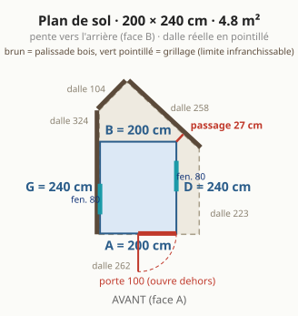
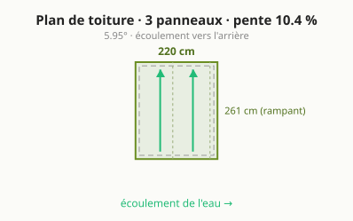
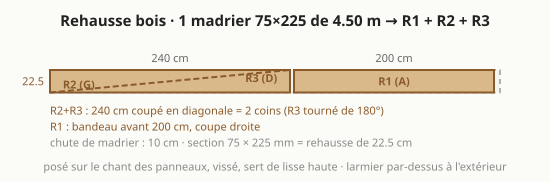
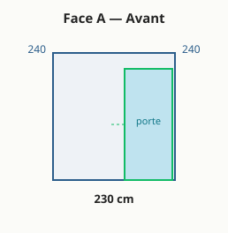
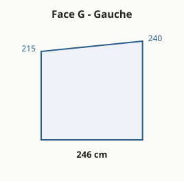
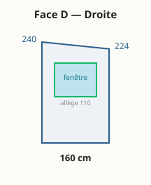
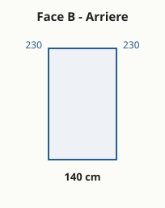

# 🏡 Abri de jardin — panneaux sandwich

Conception **paramétrique**, **spec-first** et auto-documentée d'un petit
**abri / bureau de jardin** (2,00 × 2,40 m, 4,8 m²) **rectangulaire**, murs et toit en
**panneaux sandwich 60 mm autoportants** (pas d'ossature), sur une **dalle béton déjà coulée**.

Ce dépôt contient **tout le nécessaire** : plans cotés, débit matière, liste d'achats,
cahier de montage en 6 étapes et points de vigilance — le tout généré depuis un **fichier de
paramètres unique** et publié sur un petit **site web**.

> 🌐 **Site en ligne** : **<https://rvion.github.io/screenplay/>**
> · 🧠 **Spécification** : dossier [`agent/`](agent/) · ⚙️ **Paramètres** : [`params.json`](params.json)

---

## Le principe, en une phrase

Une boîte rectangulaire dont **tous les panneaux de mur sont des rectangles identiques**
(coupes droites) ; la pente du toit vient d'une **rehausse** posée dessus : **une bande coupée
en diagonale** (deux triangles, faces gauche et droite) et **un bandeau** sur la face avant.
Une seule coupe en biais dans tout le projet. Deux ouvertures : la **porte vitrée** et une
**fenêtre** sur la face droite, calée dans un seul panneau.

| | |
|---|---|
| **Emprise** | **200 × 240 cm** = **4,8 m²** (5,2 m² débords inclus) · 4 faces : **A** avant · **D** droite · **B** arrière · **G** gauche · on peut en faire le tour |
| **Panneaux** | sandwich **60 mm autoportants**, âme PIR, pose murale verticale, **9 panneaux de 215 cm** + 1 pour la rehausse (le module A2 est pris par le bloc-porte) |
| **Toit** | **mono-pente vers l'arrière**, rehausse 25 cm (**≈ 10 %**, 5,9°), **2 panneaux toiture entiers** de ~2,61 m, rives affleurantes |
| **Porte** | **bloc-porte vitré 100 × 215** (dormant compris), face A à droite : remplace le panneau A2, rien à découper |
| **Fenêtre** | **80 × 80**, allège 110, face D, dans le 2e panneau (liste `fenetres[]`, vide = aucune) |
| **Dalle** | existante, à **coin coupé** (relevé exact à saisir) ; l'abri est posé avec 2 cm de marge, tout sur la dalle |
| **Usage** | bureau / pièce à vivre, chauffé toute l'année (ventilation obligatoire) |

---

## Plans

| Plan de sol | Plan de toiture |
|---|---|
|  |  |



| Face A — Avant | Face G — Gauche |
|---|---|
|  |  |

| Face D — Droite (fenêtre) | Face B — Arrière |
|---|---|
|  |  |

*(Le **modèle 3D interactif** est sur le site : dalle réelle, joints de panneaux, porte, toit.)*

---

## Comment ça marche (paramétrique)

Le site est **interactif** : quelques réglages (emprise, hauteur des murs, rehausse, porte,
fenêtres, largeur utile) **recalculent tout en direct** — KPIs, débit, **plans SVG cotés**, budget et
modèle 3D. Pas besoin de rien lancer pour explorer : ouvre simplement le site.

Pour le développement / régénérer les artefacts versionnés :

```bash
npm ci                              # esbuild + typescript + jsdom (dev)
$EDITOR params.json                 # éditer les cotes par défaut
npm run build && npm run emit       # bundle l'app + regénère params.js, SVG, derived.json
npm run test:raw                    # snapshots golden + smoke DOM
python3 -m http.server -d site 8000 # prévisualiser (ou ouvrir site/index.html)
```

Toute la logique vit dans [`site/src/compute.ts`](site/src/compute.ts) (géométrie, débit,
plans SVG, budget, 3D) — **pur**, donc partagé entre le navigateur, le CLI Node et les tests.
Les cotes par défaut vivent dans [`params.json`](params.json). **Aucune cote n'est écrite à
la main ailleurs.** La 3D utilise Three.js via CDN.

---

## Structure du dépôt

```
params.json          ← cotes par défaut (source unique des dimensions, en cm)
site/src/            ← app TypeScript : compute (logique) + viewer/render/controls/main
site/                ← site GitHub Pages (index.html + app.js bundlé + params.js + plans)
tests/               ← snapshots golden (compute) + smoke DOM (jsdom)
agent/               ← spécification spec-first (voir CLAUDE.md → agent/index.md)
.github/workflows/   ← build TS + tests + déploiement automatique de Pages
```

La conception détaillée vit dans [`agent/`](agent/) :
[vision](agent/00-vision.md) · [besoins](agent/01-besoins.md) ·
[spécification](agent/02-specification.md) · [décisions](agent/03-decisions.md) ·
[géométrie](agent/04-geometrie.md) · [pipeline](agent/05-pipeline.md) ·
[backlog](agent/06-backlog.md).

---

## ⚠️ Points de vigilance (résumé)

- **Dalle** : le relevé exact reste à saisir dans `dalle_cm` ; le site affiche en direct toute
  partie de l'emprise qui déborderait de la dalle.
- **Seuil des 5 m²** : 4,8 m² de murs, 5,2 m² débords inclus. Jusqu'à 5 m² d'emprise au sol
  (débords compris) : aucune formalité ; au-delà : déclaration préalable. À confirmer en mairie.
- **Portée du toit** ≈ 2,6 m en 60 mm sans panne : vérifier le tableau de portées du fabricant
  (neige/vent), sinon ajouter une panne.
- **Pente du toit** : 25 cm ≈ **10 %** (5,8°). Vérifier la pente mini du fabricant.
- **Condensation** (usage chauffé) : parements acier = pare-vapeur ⇒ risque aux ponts
  thermiques (dont le joint mur/rehausse). **Ventilation indispensable**.
- **Porte et fenêtre** : double vitrage performant (le vitrage déperd 4 à 5 fois plus que le
  panneau), fenêtre dans un seul panneau, débattement et arrêt de porte, étanchéité du seuil ;
  gouttière arrière + descente loin de la dalle.

---

## Publier le site (GitHub Pages)

Pages est sur **Source = GitHub Actions** ; le workflow
[`pages.yml`](.github/workflows/pages.yml) régénère et redéploie `site/` à chaque push sur la
branche par défaut. Site : <https://rvion.github.io/screenplay/>.
