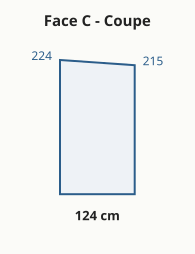

# 🏡 Abri de jardin — panneaux sandwich

Conception **paramétrique**, **spec-first** et auto-documentée d'un petit
**abri / bureau de jardin** (≈ 5 m²) à **5 faces** (carré avec un coin coupé),
murs et toit en **panneaux sandwich 60 mm**, sur une **dalle béton déjà coulée**.

Ce dépôt contient **tout le nécessaire** : plans cotés, débit matière, liste d'achats,
cahier de montage et points de vigilance — le tout généré depuis un **fichier de
paramètres unique** et publié sur un petit **site web**.

> 🌐 **Site** (après activation de Pages) : `https://<compte>.github.io/screenplay/`
> · 🧠 **Spécification** : dossier [`agent/`](agent/) · ⚙️ **Paramètres** : [`params.json`](params.json)

---

## En bref

| | |
|---|---|
| **Surface au sol** | ≈ **5,27 m²** |
| **Faces** | **A** avant (porte) · **D** droite · **C** coin coupé · **B** arrière · **G** gauche |
| **Panneaux** | sandwich **60 mm**, âme PIR, pose murale verticale |
| **Toit** | **mono-pente vers l'arrière**, chute 25 cm (**≈ 10 %**, dans la plage admise) |
| **Porte** | **vitrée, ouvrant vers l'extérieur**, source principale de lumière |
| **Usage** | bureau / pièce à vivre, chauffé toute l'année |

### Mesures relevées sur la dalle (cm)
Gauche **246** · Avant **230** · Droite jusqu'à la coupe **160** · Arrière jusqu'à la coupe **140**
→ face **C** (coupe) **calculée** ≈ **124,5 cm** · périmètre ≈ **900 cm**.

---

## Plans

| Plan de sol | Plan de toiture |
|---|---|
|  |  |

| Face A — Avant | Face G — Gauche | Face B — Arrière |
|---|---|---|
|  |  |  |

| Face D — Droite | Face C — Coin coupé |
|---|---|
|  |  |

*(Le **modèle 3D interactif** est sur le site.)*

---

## Comment ça marche (paramétrique)

```bash
# 1. éditer les cotes
$EDITOR params.json
# 2. régénérer plans + débit + liste d'achats + données 3D
python3 scripts/generate.py
# 3. prévisualiser le site
python3 -m http.server -d site 8000   # http://localhost:8000
```

Tout est calculé depuis [`params.json`](params.json) : plans SVG, tableaux du site et
modèle 3D. **Aucune cote n'est écrite à la main ailleurs.** `generate.py` n'utilise que la
**bibliothèque standard Python** (rien à installer) ; la 3D utilise Three.js via CDN.

---

## Structure du dépôt

```
params.json          ← source unique de vérité (cotes en cm)
scripts/generate.py  ← génère plans SVG + data.js + derived.json
agent/               ← spécification spec-first (voir CLAUDE.md)
site/                ← site GitHub Pages (index.html + 3D + plans + tableaux)
.github/workflows/   ← déploiement automatique de Pages
CLAUDE.md            ← référence la spec agent/ (contexte de l'agent)
```

La conception détaillée vit dans [`agent/`](agent/) :
[vision](agent/00-vision.md) · [besoins](agent/01-besoins.md) ·
[spécification](agent/02-specification.md) · [décisions](agent/03-decisions.md) ·
[géométrie](agent/04-geometrie.md) · [pipeline](agent/05-pipeline.md) ·
[backlog](agent/06-backlog.md).

---

## ⚠️ Points de vigilance (résumé)

- **Pente du toit** : réglée à 25 cm ≈ **10 %** (5,8°), dans la plage admise par la plupart des
  panneaux de toiture. **Vérifier la pente mini exacte du fabricant.** Paramètre `toit.pente_chute_cm`.
- **Condensation** (usage chauffé) : parements acier = pare-vapeur ⇒ risque aux ponts
  thermiques. **Ventilation (VMC/aérateurs) indispensable**.
- **Drainage** : eau vers le coin arrière-droit → gouttière sur B + C + descente au point bas,
  évacuée loin de la dalle ; bande d'étanchéité au pied.
- **Angle C non orthogonal** : profils d'angle pliables/sur-mesure, coupes d'about soignées.
- **Porte extérieure** : vérifier débattement, arrêt de porte (vent), étanchéité du seuil.

Détail complet : section « Points de vigilance » du site et [`agent/03-decisions.md`](agent/03-decisions.md).

---

## Publier le site (GitHub Pages)

1. Rendre le dépôt **public**.
2. *Settings → Pages → Source = **GitHub Actions***.
3. Pousser sur `main` : le workflow [`pages.yml`](.github/workflows/pages.yml) régénère et
   déploie `site/`. L'URL apparaît dans l'onglet **Actions / Pages**.

> Statut : développé sur la branche `claude/garden-shed-docs-n7eq2b`.
> Le rendu 3D n'a pas pu être validé dans un navigateur réel pendant la génération
> (cf. [`agent/06-backlog.md`](agent/06-backlog.md)) — à vérifier après publication.
