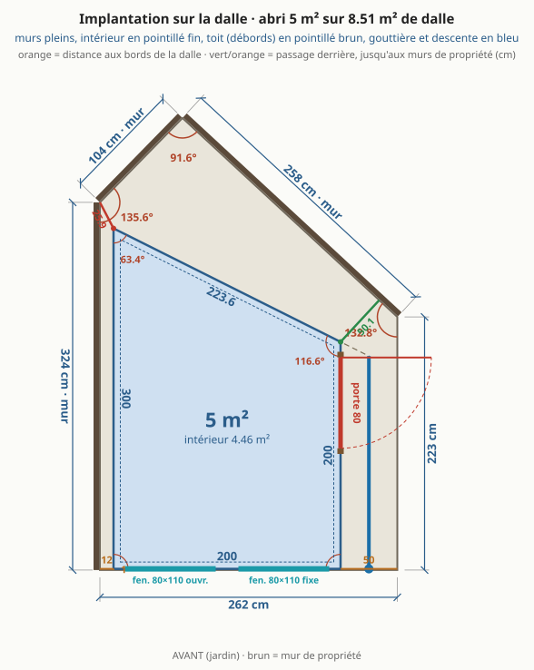
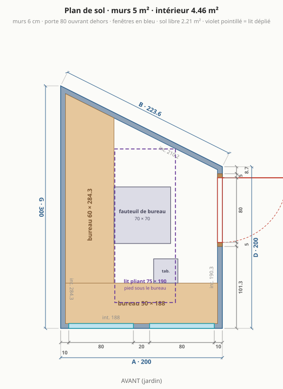
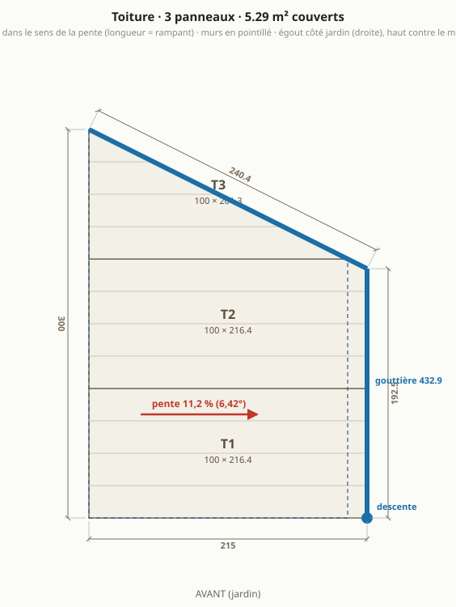
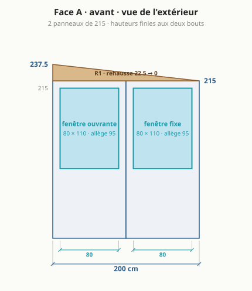
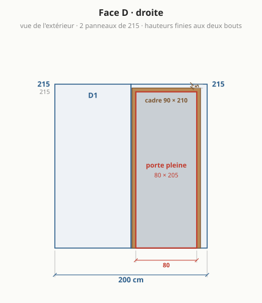
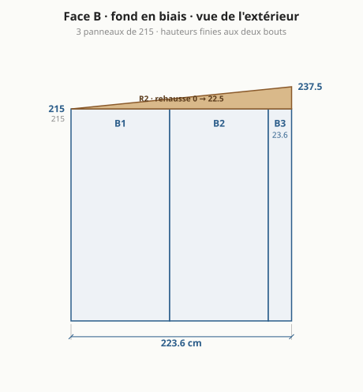
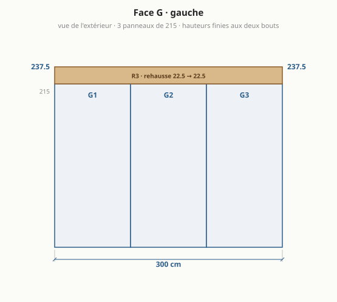
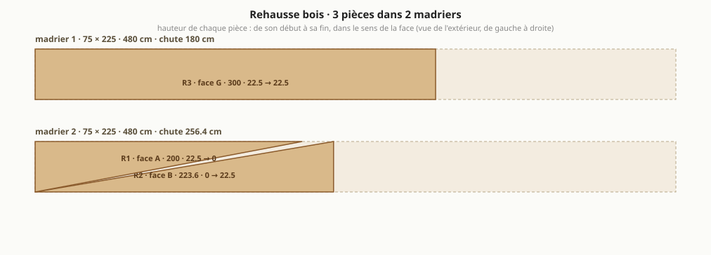

# Abri de jardin : le bureau trapèze, version 2 (calée sur les panneaux)

> Généré par `npm run emit` depuis `params.json` (bloc `abri_v2`) et `site/src/compute.ts` : ne pas éditer à la main. Version de départ : [abri-v1.md](abri-v1.md). Autres formes étudiées : [variantes.md](variantes.md).

## Ce qui change par rapport à la version 1

| | version 1 ([abri-v1.md](abri-v1.md)) | **version 2** |
|---|---|---|
| murs (extérieur) | 5,37 m² | 5 m² |
| intérieur | **4,81 m²** | **4,46 m²** |
| emprise au sol (débords de toit exclus, R*420-1) | 5,37 m² | 5 m² |
| formalités (seuils 5 puis 20 m²) | déclaration préalable | aucune formalité |
| murs | 4 : A 218 · D 178,8 · B 256,6 · G 314,1 cm | 4 : A 200 · D 200 · B 223,6 · G 300 cm |
| angles | 90° · 90° · 121,8° · 58,2° | 90° · 90° · 116,6° · 63,4° |
| faces en panneaux entiers | aucune | A, D, G |
| bandes de mur de moins de 30 cm | 2 | 1 |
| panneaux de mur à commander | 10 | 10 |
| passage derrière l'abri | 50,6 cm | 51,5 cm |
| sens du toit | vers le fond (mur de propriété) | vers la droite (jardin) |
| pente | 9,6 % (5,46°), chute 30 cm | 11,2 % (6,42°), chute 22,5 cm |
| portée du toit sans panne | 3,14 m | 2 m |
| panneaux de toit | 3, dont 3 coupé(s) en biais et 1 de moins de 30 cm de large | 3, dont 2 coupé(s) en biais et 0 de moins de 30 cm de large |
| gouttière et descente | 256,6 cm sur B, descente au coin arrière gauche | 432,9 cm sur D + B, descente devant à droite, côté jardin |
| rehausse | 4 pièces, 2 madrier(s) 75 × 300 | 3 pièces, 2 madrier(s) 75 × 225 |
| hauteurs finies des coins | 245 · 245 · 227,9 · 215 cm | 237,5 · 215 · 215 · 237,5 cm |
| espace caché derrière l'abri | 1,88 m², jusqu'à 99 cm de profondeur | 1,9 m², jusqu'à 115 cm de profondeur |
| porte | vitrée, 65 × 205, débord de toit au-dessus : 0 cm | pleine, 80 × 205, débord de toit au-dessus : 15 cm |
| fenêtres en façade | 100 fixe | 80 ouvrante + 80 fixe |
| sol libre hors bureaux | 2,41 m² | 2,21 m² |
| lit | 75 × 190, rabattable contre le fond | 75 × 190, pliant, posé au sol libre |
| budget indicatif HT | 3 461 € (coque 3 186 €) | 3 119 € (coque 2 865 €) |

### Ce que cette disposition apporte

- **À l'abri des regards.** Les voisins de l'étage voient la façade de l'abri. Avec la porte sur le mur droit, de côté, une porte ouverte ne leur montre jamais l'intérieur : ils ne voient que le battant. La porte est **pleine**, pas vitrée : fermée, elle ne montre rien non plus. Il reste les deux fenêtres de façade : petites (80 × 80) et hautes (allège à 110 cm), elles donnent sur le bord du plateau et pas sur les écrans ; un store règle le reste.
- **La lumière de côté, comme le demande l'ergonomie.** Le jour n'entre que par les fenêtres de façade. L'ordinateur et le second écran vont sur le bureau gauche, contre le mur aveugle : assis face à ce mur, on reçoit la lumière **par le côté gauche**, écrans perpendiculaires aux fenêtres, sans fenêtre dans le dos ni en face. Une porte vitrée sur le mur droit aurait été exactement dans le dos, en reflet sur les écrans : la porte pleine supprime ce défaut.
- **Les outils de jardin cachés derrière, et pas de second abri.** Derrière le mur du fond il reste **1,9 m² de dalle**, profonds de 115 cm au plus large, entre l'abri et le mur de propriété : invisibles depuis le jardin et depuis la maison, hachurés en vert sur le plan d'implantation. Outils à manche accrochés au mur, tuyau, pots, sacs de terreau, échelle : tout y tient, le jardin garde une seule construction et reste dégagé. On y accède par le passage de 51 cm le long du grand pan. **À vérifier :** ce qui est plus large que ce passage n'y entre pas (une brouette fait environ 60 cm, certaines tondeuses 50 à 55) ; mesurer la tondeuse avant de compter dessus.

### Ce que la version 2 perd

- **0,35 m² d'intérieur en moins** (4,46 au lieu de 4,81 m²), pris surtout dans le coin aigu du fond, la surface la moins utile.
- **Le lit rabattable contre le fond ne tient plus** : un lit de 190 plaqué contre le mur en biais demande un mur d'au moins 244 cm (le coin aigu et le coin obtus mangent chacun leur part), et le fond ne fait plus que 224 cm. La version 2 garde un lit pliant de 75 × 190 posé au sol libre, sièges rangés (`lit_pliant.contre` vide). Garder le lit rabattable impose un fond de 244 cm au moins, donc de sortir du module ou du seuil de 5 m².
- **Bureau gauche plus court de 13 cm** (284 au lieu de 297 cm) : sans effet, aucun siège n'atteint le bout.
- **Un peu plus chère** (voir la ligne budget du tableau) : l'écart vient de la deuxième fenêtre, ouvrante. À fenêtres égales la coque de la version 2 coûte moins (madrier courant, toit plus court).

### Pourquoi

1. **Trois murs au module de 100** (façade 200, droite 200, gauche 300) : la façade et le mur gauche ne sont que des panneaux entiers. Le mur gauche longe le mur de propriété à 10 cm : une fois monté, on n'y accède plus, il ne doit porter aucune recoupe. La seule bande à recouper est sur le fond en biais, qu'on atteint par le passage.
2. **5,00 m² de murs** : au seuil sans formalité (emprise et plancher ≤ 5 m²), au lieu d'une déclaration préalable pour 0,37 m² de murs en plus. Le prix : 0,35 m² d'intérieur en moins, pris surtout dans le coin aigu du fond.
3. **Abri avancé de 4 cm** (bande libre avant 1 au lieu de 5) : la porte n'est plus en façade, cette bande ne sert plus. Le passage derrière l'abri retrouve 50 cm.
4. **Toit vers la droite, côté jardin**, au lieu du fond : descente devant, côté jardin, accessible tous les jours, récupérateur d'eau possible (aujourd'hui toute l'eau du toit arrive au coin le plus enfermé, au pied du mur de propriété). **Attention :** l'eau du fond du toit sort par le mur du fond en biais, pas par le mur droit. La gouttière doit donc courir aussi le long du fond, en pente naturelle vers le coin droit où elle rejoint celle du mur droit (le modèle la compte sur les deux bords : voir le tableau). Sans ce tronçon, cette eau tomberait dans le passage arrière.
5. **Portée du toit 2,0 m** au lieu de 3,1 m : les panneaux vont du mur gauche au mur droit. C'était l'hypothèse la plus fragile du projet (H6).
6. **Chute 22,5 cm sur 2 m = 11 %** : le madrier courant 75 × 225 suffit, plus besoin d'un 75 × 300 introuvable en stock. Le mur droit (porte) ne reçoit aucune rehausse, le mur gauche aveugle est le mur haut.
7. **Toit en 3 panneaux de 100 de large, sans bande étroite** (la version 1 a un panneau de toit de 18 cm) : T1 entier, T2 écorné d'un petit coin sous le débord, T3 coupé une fois en biais le long du fond. Rives avant et fond affleurantes, fermées par une bavette.
8. **Débord de 15 cm à droite** : il abrite la porte, qui n'a aucun auvent dans la version 1. Volontairement court : il ne coûte rien (c'est la longueur des panneaux de toit) et reste discret.
9. **Porte pleine de 80** : une porte de service standard (un fauteuil de bureau ne passe pas dans 65, et un bloc vitré de 65 est du sur-mesure). Elle tient entièrement dans le deuxième module du mur droit : le panneau D1 reste entier, le cadre bois fait office de poteau d'angle.
10. **Deux fenêtres de 80 × 80, allège à 110 cm**, une par panneau entier de façade, l'ouvrante à gauche, en diagonale de la porte pour la ventilation traversante. Petites et hautes : assis, le regard passe juste au-dessus de l'allège (yeux vers 120 cm), et depuis l'étage des voisins on voit moins le plateau du bureau qu'avec des fenêtres de 110 de haut.

### Conseils que les plans ne montrent pas

- La gouttière a **deux tronçons et un angle** (fond en biais, puis mur droit) : pièce d'angle à prévoir à la commande, le budget ne compte qu'un forfait.
- Lit rabattable et bureaux **sur pieds ou équerres au sol** : les parements acier de 0,5 mm ne reprennent pas une charge suspendue. Les fixations murales ne tiennent le lit que replié.
- Arrêter le **bureau gauche vers 220 cm** et mettre un meuble haut dans le coin aigu du fond : aucun siège n'atteint le bout du plateau.
- Monter le **mur gauche à plat puis le lever** (3 panneaux + rehausse, environ 80 kg) : à 10 cm du mur de propriété, aucune visseuse ne passe. Fermer ce vide par une bavette devant et un grillage au fond (feuilles, nids).
- **Store sur les fenêtres de façade** plutôt que sur la porte : ce sont elles qui font face aux écrans. À dimensionner selon l'orientation réelle.
- Porte **ferrée côté fond** : ouverte, elle s'efface vers l'arrière quand on arrive du jardin. Deux ou trois dalles de jardin en guise de seuil, la dalle s'arrêtant au ras du mur droit.
- À exactement 5,00 m², une mairie pointilleuse peut discuter : raccourcir le mur gauche à 298 donne 4,98 m² pour une recoupe de 2 cm.

## En bref

- **Dalle existante** : 8,51 m², côtés 262 / 223 / 258 / 104 / 324 cm, murs de propriété à gauche et au fond.
- **4,46 m² intérieur** (5 m² de murs), 51,5 cm de passage derrière.
- **4 murs** en panneaux sandwich 6 cm autoportants : façade 200, droite 200, fond en biais 223,6, gauche 300 cm.
- **Toit** mono-pente vers la droite (jardin), 6,42° : 237,5 cm contre le mur gauche, 215 cm côté porte.
- **Porte pleine** 80 × 205 sur le mur droit, **2 fenêtres** en façade, **bureau en L** sur la façade et le mur gauche.
- **Matériaux** : 3 119 € TTC (2 651 € à 3 587 €), sans main-d'œuvre ni livraison ; équipement optionnel 259 €.

- **Formalités** : emprise au sol 5 m², surface de plancher 4,46 m² ⇒ aucune formalité.

## À trancher

- **Toit** : vers la droite (jardin), chute 22,5 cm (6,42°). Madrier 75 × 225 classe 4 : section courante, à vérifier en classe 4.
- **Formalités** : emprise au sol **5 m²** (les débords de toit, simples et en l'air, n'entrent pas dans l'emprise au sol : Code de l'urbanisme R*420-1), surface de plancher 4,46 m² ⇒ **aucune formalité** (seuils 5 puis 20 m²). secteur protégé ou abords d'un monument historique : déclaration préalable même sous le seuil ; le PLU (implantation, hauteur, distance aux limites) s'applique dans tous les cas.
- **Lit 75 × 190** : déplié au milieu, le pied sous un bureau, fauteuil et tabouret rangés.
- **Portée du toit** (~2 m au plus long) en 6 cm sans panne : à confirmer dans le tableau du fabricant.
- **Angles non droits** (116,6°, 63,4°) : profils d'angle pliés sur mesure.

## Plans

### Implantation sur la dalle

### Plan de sol

### Toiture

### Face A · façade (jardin)

### Face D · droite (porte)

### Face B · fond en biais

### Face G · gauche

### Rehausse bois : débit des madriers

## Dimensions

| face | longueur ext. | longueur int. | hauteur finie (début → fin) | angle au début |
|---|---|---|---|---|
| A · avant | 200 cm | 188 cm | 237,5 → 215 cm | 90° |
| D · droite | 200 cm | 190,3 cm | 215 → 215 cm | 90° |
| B · fond en biais | 223,6 cm | 210,2 cm | 215 → 237,5 cm | 116,6° |
| G · gauche | 300 cm | 284,3 cm | 237,5 → 237,5 cm | 63,4° |

Murs 5 m² · intérieur 4,46 m² (murs de 6 cm retirés) · sol libre hors bureaux 2,21 m² · hauteur sous plafond 2,32 m devant, 2,09 m au plus bas (plancher isolé déduit).

## Débit

### Panneaux de mur (hauteur 215 cm, pose verticale)

| pièce | largeur | provenance | découpe |
|---|---|---|---|
| A1 | 100 cm | panneau entier | fenêtre 80 × 80 |
| A2 | 100 cm | panneau entier | fenêtre 80 × 80 |
| D1 | 100 cm | panneau entier | – |
| D2 | 100 cm | panneau entier | porte 90 × 210 |
| B1 | 100 cm | panneau entier | – |
| B2 | 100 cm | panneau entier | – |
| B3 | 23,6 cm | panneau recoupé | – |
| G1 | 100 cm | panneau entier | – |
| G2 | 100 cm | panneau entier | – |
| G3 | 100 cm | panneau entier | – |

**10 panneaux de mur** de 100 × 215 à commander (les bandes étroites sortent des chutes).

### Panneaux de toit (dans le sens de la pente, longueur = rampant)

| pièce | largeur | longueur à commander | coupe |
|---|---|---|---|
| T1 | 100 cm | 216,4 cm | entier, coupes droites |
| T2 | 100 cm | 216,4 cm | un bord en biais le long du mur du fond |
| T3 | 100 cm | 201,3 cm | un bord en biais le long du mur du fond |

Débords : 15 cm à droite (égout, au-dessus de la porte), 0 cm contre le mur de propriété, rives avant et fond affleurantes (bavette de rive). Surface couverte 5,29 m².

### Rehausse bois (madrier 75 × 225, stock 480 cm)

| pièce | face | longueur | hauteur début → fin |
|---|---|---|---|
| R1 | A | 200 cm | 22,5 → 0 cm |
| R2 | B | 223,6 cm | 0 → 22,5 cm |
| R3 | G | 300 cm | 22,5 → 22,5 cm |

**2 madriers** : n°1 = R3 (chute 180 cm) ; n°2 = R2 + R1 (chute 256,4 cm). Deux pièces sur un même tronçon = une seule coupe en biais.

### Gouttière et profils

- Gouttière 432,9 cm en 2 tronçons (D 192,5 + B 240,4) : le long du pan en biais puis du mur droit, avec un angle, au-dessus de la porte ; descente au coin avant droit, côté jardin (récupérateur d'eau possible). Aucune eau dans le passage arrière ni au pied du mur de propriété.
- 4 angles : G/A 90°, A/D 90°, D/B 116,6°, B/G 63,4° ; hauteur de chaque angle = hauteur finie du coin.
- Rail de pied sur tout le périmètre (9,24 m), bavettes de rive sur les côtés A et B.

## Ouvertures

| ouverture | taille | où | détail |
|---|---|---|---|
| porte pleine | 80 × 205 (cadre 90 × 210) | face D, de 106,3 à 186,3 cm depuis la façade | ouvre vers l'extérieur ; cadre à 5 cm du mur du fond (face intérieure) et sous le haut du mur |
| fenêtre oscillo-battante | 80 × 80 | face A, de 10 à 90 cm depuis le coin gauche | allège 110 cm, au-dessus du bureau, dans un seul panneau |
| fenêtre fixe | 80 × 80 | face A, de 110 à 190 cm depuis le coin gauche | allège 110 cm, au-dessus du bureau, dans un seul panneau |

## Aménagement

| élément | taille | place |
|---|---|---|
| bureau gauche | 60 × 284,3 cm | tout le mur gauche |
| bureau de façade | 50 × 188 cm | tout le mur de façade |
| fauteuil de bureau | 70 × 70 cm | devant le bureau gauche |
| tabouret | 30 × 30 cm | devant le bureau de façade |
| lit pliant (déplié) | 75 × 190 cm | au milieu, pied sous un bureau, sièges rangés |

## Matériaux à acheter (prix TTC, sans main-d'œuvre, sans livraison)

### Panneaux · 1 157 €

| matériau | quantité | prix unitaire | montant | comment c'est compté |
|---|---|---|---|---|
| Panneaux sandwich de mur 60 mm, 100 × 215 cm *(prix à confirmer)* | 21,5 m² | 42 € | 903 € | 10 panneaux entiers à commander (les bandes recoupées sortent des chutes) |
| Panneaux sandwich de toiture 60 mm, nervurés, teinte claire *(prix à confirmer)* | 6,34 m² | 40 € | 254 € | 3 panneaux coupés à longueur : T1 216,4 cm, T2 216,4 cm, T3 201,3 cm |

### Bois · 159 €

| matériau | quantité | prix unitaire | montant | comment c'est compté |
|---|---|---|---|---|
| Madrier 75 × 225 classe 4 (rehausse, lisse haute) *(prix à confirmer)* | 9,6 ml | 14 € | 134 € | 2 pièce(s) de 480 cm |
| Bois du cadre de porte, section 50 × 60 mm *(prix à confirmer)* | 5 ml | 5 € | 25 € | deux montants + une traverse haute |

### Profils et bavettes · 413 €

| matériau | quantité | prix unitaire | montant | comment c'est compté |
|---|---|---|---|---|
| Profil de départ en U (rail de pied) *(prix à confirmer)* | 8,34 ml | 9 € | 75 € | périmètre des murs moins le cadre de la porte |
| Profils d'angle à 90°, extérieur + intérieur *(prix à confirmer)* | 9,05 ml | 10 € | 91 € | 2 angles droits, hauteur finie de chaque coin, deux faces |
| Profils d'angle pliés sur mesure (116,6°, 63,4°), extérieur + intérieur *(prix à confirmer)* | 9,05 ml | 18 € | 163 € | 2 angles non droits, deux faces |
| Bandes de rive de toit *(prix à confirmer)* | 2,15 ml | 12 € | 26 € | bords du toit parallèles à la pente |
| Bavette de tête (bord haut du toit) *(prix à confirmer)* | 3 ml | 12 € | 36 € | bord haut du toit |
| Closoirs mousse sous les nervures *(prix à confirmer)* | 7,33 ml | 3 € | 22 € | bord haut + bord d'égout |

### Fixations · 50 €

| matériau | quantité | prix unitaire | montant | comment c'est compté |
|---|---|---|---|---|
| Vis autoperceuses de toiture à rondelle, longues (panneau + nervure dans le bois) *(prix à confirmer)* | 0,27 cent | 45 € | 12 € | 3 panneaux × 2 appuis × 4 vis, +10 % |
| Vis de couture (recouvrements de panneaux, bavettes, profils) *(prix à confirmer)* | 0,64 cent | 12 € | 8 € | un recouvrement tous les 40 cm, une bavette tous les 30 cm, +10 % |
| Vis autoperceuses de panneaux de mur (pied et tête) *(prix à confirmer)* | 0,66 cent | 25 € | 17 € | 10 panneaux × 2 extrémités × 3 vis, +10 % |
| Chevilles ou goujons pour fixer le rail dans la dalle *(prix à confirmer)* | 21 u | 1 € | 13 € | une tous les 50 cm |

### Étanchéité · 127 €

| matériau | quantité | prix unitaire | montant | comment c'est compté |
|---|---|---|---|---|
| Bande d'arase sous le rail de pied *(prix à confirmer)* | 9,24 ml | 2 € | 14 € | périmètre des murs |
| Bande butyle (joints de panneaux, tête de mur sous la rehausse) *(prix à confirmer)* | 26,14 ml | 1 € | 31 € | 6 joints de mur × 2,2 m + périmètre + recouvrements de toit |
| Mastic polyuréthane ou MS polymère, cartouches *(prix à confirmer)* | 4 cartouche | 9 € | 36 € | une cartouche pour 8 m de cordon : pied de mur dedans et dehors, tour des ouvertures |
| Bande comprimée au pourtour des ouvertures *(prix à confirmer)* | 11,3 ml | 3 € | 28 € | tour de la porte et des fenêtres |
| Mousse polyuréthane expansive, bombes *(prix à confirmer)* | 2 bombe | 9 € | 18 € | calfeutrement des ouvertures et des angles |

### Ouvertures · 820 €

| matériau | quantité | prix unitaire | montant | comment c'est compté |
|---|---|---|---|---|
| Porte de service pleine isolée 80 × 205 cm, avec dormant *(prix à confirmer)* | 1 u | 450 € | 450 € | une porte |
| Fenêtre fixe PVC double vitrage 80 × 80 cm *(prix à confirmer)* | 1 u | 150 € | 150 € | fenêtres fixes |
| Fenêtre oscillo-battante PVC double vitrage 80 × 80 cm *(prix à confirmer)* | 1 u | 220 € | 220 € | fenêtres ouvrantes |

### Eaux pluviales · 99 €

| matériau | quantité | prix unitaire | montant | comment c'est compté |
|---|---|---|---|---|
| Gouttière demi-ronde *(prix à confirmer)* | 4,33 ml | 6 € | 26 € | 2 tronçon(s) : D 192,5 cm + B 240,4 cm |
| Crochets de gouttière *(prix à confirmer)* | 10 u | 3 € | 25 € | un tous les 50 cm |
| Naissance, fonds, angle, coudes et colliers (lot) *(prix à confirmer)* | 1 lot | 35 € | 35 € | un angle, une naissance, deux fonds, deux coudes, deux colliers |
| Tuyau de descente *(prix à confirmer)* | 2,15 ml | 6 € | 13 € | hauteur du mur côté égout |

### Plancher isolé · 254 €

| matériau | quantité | prix unitaire | montant | comment c'est compté |
|---|---|---|---|---|
| Lambourdes traitées (entraxe 40 cm) *(prix à confirmer)* | 13 ml | 2 € | 26 € | surface intérieure ÷ 0,40 m, +10 % |
| Isolant rigide 40 mm entre lambourdes *(prix à confirmer)* | 4,68 m² | 12 € | 56 € | surface intérieure, +5 % |
| Film polyéthylène sous le plancher *(prix à confirmer)* | 5,13 m² | 1 € | 5 € | surface intérieure, +15 % de recouvrements |
| Dalles OSB3 18 mm rainurées *(prix à confirmer)* | 4,91 m² | 14 € | 69 € | surface intérieure, +10 % de chutes |
| Revêtement de sol (vinyle ou stratifié) *(prix à confirmer)* | 4,91 m² | 20 € | 98 € | surface intérieure, +10 % de chutes |

### Équipement (optionnel) · 259 €

| matériau | quantité | prix unitaire | montant | comment c'est compté |
|---|---|---|---|---|
| Grilles ou entrées d'air murales *(prix à confirmer)* | 2 u | 15 € | 30 € | une basse, une haute, sur deux murs opposés |
| Goulotte électrique 2 m *(prix à confirmer)* | 3 u | 8 € | 24 € | la moitié du périmètre, en longueurs de 2 m |
| Multiprise parafoudre *(prix à confirmer)* | 1 u | 25 € | 25 € | sur le câble déjà en place |
| Réglette ou plafonnier LED *(prix à confirmer)* | 1 u | 30 € | 30 € | un point lumineux |
| Radiateur panneau 750 W à thermostat *(prix à confirmer)* | 1 u | 90 € | 90 € | bureau chauffé toute l'année |
| Stores des fenêtres de façade *(prix à confirmer)* | 2 u | 30 € | 60 € | un par fenêtre |

### Consommables · 40 €

| matériau | quantité | prix unitaire | montant | comment c'est compté |
|---|---|---|---|---|
| Lame de scie circulaire pour métal (coupe à froid des panneaux) *(prix à confirmer)* | 1 u | 40 € | 40 € | jamais de meuleuse : elle brûle le laquage et la mousse |

**Total des matériaux : 3 119 € TTC** (fourchette 2 651 € à 3 587 €, ±15 %). Équipement optionnel en plus : 259 €. Hors total : Livraison des panneaux (service, hors total) ≈ 250 €.

Prix relevés chez des marchands français (`prix_materiaux_eur_ttc` dans `params.json`, source notée pour chacun) ; les quantités se recalculent avec l'abri.

## Guide de montage

### Avant de commander

- Faire confirmer par le fournisseur la **largeur utile** des panneaux (100 cm ici) : tout le calepinage en dépend.
- Faire confirmer la **portée** admise du panneau de toit de 6 cm : 2 m ici ; et la **pente minimale** (11,2 % ici).
- Commander les panneaux de toit **coupés à longueur**, et les profils des angles de 116,6° et 63,4° **pliés sur mesure**, en même temps que les panneaux.
- Vérifier au PLU la règle d'implantation près de la limite (l'abri est à 10 cm du mur de propriété).
- Prévoir deux personnes pour lever les murs et poser le toit, et une journée sans vent : un panneau de 2 m² est une voile.

### Outillage

- Scie circulaire avec **lame pour métal** (coupe à froid) et rail de guidage ; scie sauteuse lame métal pour les angles des ouvertures. **Pas de meuleuse** : elle brûle le laquage et la mousse, et ses étincelles piquent la tôle.
- Visseuse à choc avec douilles 8 mm, perforateur et foret béton, cordeau à tracer, mètre de 5 m, niveau de 1,20 m ou laser, grande équerre, fil à plomb.
- Pistolet à mastic, cutter, serre-joints, 4 étais ou chevrons pour tenir les murs pendant le montage, échelle ou escabeau stable.
- Gants anti-coupure, lunettes, protection auditive. Les rives de tôle coupent.

### Étape 1 · Tracer l'abri sur la dalle

Tout le reste s'aligne sur ce tracé : dix minutes de plus ici évitent un mur qui ne ferme pas.

**Outils :** cordeau, mètre, grande équerre

1. Tracer la façade à 1 cm du bord avant de la dalle et le mur gauche à 10 cm du bord gauche.
2. Reporter les 4 murs dans l'ordre : A 200 cm, D 200 cm, B 223,6 cm, G 300 cm.
3. Angles, dans le même ordre : 90°, 90°, 116,6°, 63,4°.

**À contrôler avant de continuer :**

- [ ] Diagonales du tracé : coin avant gauche → haut du mur droit = 282,8 cm ; coin avant droit → coin arrière gauche = 360,6 cm.
- [ ] Passage derrière l'abri : 51,5 cm au plus étroit, à mesurer une fois le tracé fait.

### Étape 2 · Poser le rail de pied

Le rail tient le pied des panneaux et les isole de l'eau de la dalle.

**Outils :** perforateur, visseuse, niveau

1. Dérouler la bande d'arase sur le tracé (9,24 m), poser le profil en U dessus, **nu extérieur du rail sur le trait**.
2. Cheviller tous les 50 cm, et à 10 cm de chaque angle.
3. Interrompre le rail sur la largeur du cadre de la porte (90 cm, face D).
4. Cordon de mastic continu entre le rail et la dalle, côté extérieur.

**À contrôler avant de continuer :**

- [ ] Rail de niveau : caler si la dalle a plus de 5 mm de faux niveau sur un mur.
- [ ] Angles du rail conformes au tracé avant de cheviller le dernier mur.

### Étape 3 · Préparer toutes les coupes à plat

Un panneau se coupe bien sur tréteaux, mal une fois debout.

**Outils :** scie circulaire lame métal, rail de guidage, scie sauteuse

1. Bandes de mur : B3 23,6 cm. Couper dans la longueur, face laquée vers le bas, et garder les chutes : elles fournissent les autres bandes.
2. Fenêtres : 80 × 80 cm, bas à 110 cm ; 80 × 80 cm, bas à 110 cm, une par panneau, jamais sur un joint. Percer les quatre angles, puis couper à la scie sauteuse.
3. Toit : T2, T3 à couper en biais d'après le plan de toiture.
4. Rehausse : R1 (mur A, 200 cm, 22,5 → 0 cm), R2 (mur B, 223,6 cm, 0 → 22,5 cm), R3 (mur G, 300 cm, 22,5 → 22,5 cm), tirées de 2 madrier(s) selon le plan de débit.

**À contrôler avant de continuer :**

- [ ] Retirer le film de protection des panneaux au fur et à mesure : après quelques semaines au soleil il ne part plus.
- [ ] Ébavurer chaque coupe et passer une retouche de peinture sur la tôle mise à nu.

### Étape 4 · Monter le mur gauche à plat, puis le lever

À 10 cm du mur de propriété aucune visseuse ne passe : ce mur se fait au sol.

**Outils :** visseuse, serre-joints, 2 personnes, étais

1. Assembler G1 (100), G2 (100), G3 (100) à plat, butyle dans chaque joint, et visser dessus leur pièce de rehausse.
2. Lever le mur à deux, l'engager dans le rail, le tenir par deux étais vissés dans la rehausse.
3. Visser le pied dans le rail depuis l'intérieur.

**À contrôler avant de continuer :**

- [ ] Aplomb dans les deux sens avant de lâcher les étais.
- [ ] Vide de 10 cm régulier sur toute la longueur.

### Étape 5 · Monter les autres murs

On tourne dans un seul sens pour que chaque panneau s'emboîte dans le précédent.

**Outils :** visseuse, niveau, étais

1. Mur B (fond en biais, 223,6 cm) : B1 (100), B2 (100), B3 (23,6).
2. Mur D (droite, 200 cm) : D1 (100), D2 (100), en laissant le vide du cadre de porte.
3. Mur A (façade, 200 cm) : A1 (100), A2 (100).
4. Butyle dans chaque emboîtement, panneau serré contre le précédent, vissé au pied dans le rail.
5. Étayer chaque mur tant que la rehausse n'est pas posée : avant elle, rien ne tient les têtes.

**À contrôler avant de continuer :**

- [ ] Aplomb de chaque panneau avant de visser le suivant : l'erreur se cumule.
- [ ] Têtes de murs toutes à 215 cm, à 3 mm près, au niveau laser.

### Étape 6 · Fermer les angles

Les profils d'angle lient deux murs et ferment la mousse.

**Outils :** visseuse, mastic

1. Profil extérieur puis intérieur à chacun des 4 angles, vissé tous les 30 cm (vis de couture), mastic sous les deux ailes.
2. Les angles de 116,6° et 63,4° reçoivent les profils pliés sur mesure : les présenter à blanc avant de percer.
3. Bourrer le vide de l'angle à la mousse avant de fermer le profil intérieur.

**À contrôler avant de continuer :**

- [ ] Aucun jour entre profil et panneau : c'est là que l'air et l'eau entrent.

### Étape 7 · Poser la rehausse bois

Elle donne la pente au toit et sert de lisse haute : c'est elle qui tient les murs entre eux.

**Outils :** visseuse, serre-joints

1. Poser R1 sur A, R2 sur B, R3 sur G, sur un cordon de butyle en tête de panneaux.
2. Visser la rehausse dans la tôle des deux faces de chaque panneau, tous les 40 cm.
3. Assembler les pièces entre elles aux angles par deux longues vis en biais.

**À contrôler avant de continuer :**

- [ ] Hauteurs finies des coins : 237,5 · 215 · 215 · 237,5 cm (dans l'ordre des coins, à partir du coin avant gauche).
- [ ] Dessus de la rehausse dans un même plan : poser une règle d'un mur à l'autre.

### Étape 8 · Couvrir

Nervures dans le sens de la pente, vers la droite (jardin) : l'eau ne quitte le toit que par le bas des panneaux.

**Outils :** visseuse, 2 personnes, échelle

1. Poser T1 (100 × 216,4 cm), T2 (100 × 216,4 cm), T3 (100 × 201,3 cm), en commençant du côté opposé aux vents dominants.
2. Closoirs mousse sous les nervures, en haut et en bas, avant de visser.
3. Visser dans la rehausse par le sommet des nervures, vis longues à rondelle, quatre par panneau et par appui. Serrer jusqu'à écraser la rondelle, pas plus.
4. Recouvrements entre panneaux : butyle, puis vis de couture tous les 40 cm.
5. Bandes de rive sur les bords parallèles à la pente, bavette de tête sur le bord haut.

**À contrôler avant de continuer :**

- [ ] Débords : 0 cm devant, 0 cm au fond, 15 cm à droite, 0 cm à gauche.
- [ ] Ne jamais marcher entre deux appuis : marcher au droit des murs, sur une planche.

### Étape 9 · Gouttière et descente

Recueillir toute l'eau du toit et l'emmener au jardin.

**Outils :** visseuse, niveau, scie à métaux

1. 432,9 cm de gouttière en 2 tronçon(s) : D 192,5 cm + B 240,4 cm.
2. Crochets tous les 50 cm, pente de 5 mm par mètre vers la descente.
3. Descente au point bas, évacuée loin de la dalle.

**À contrôler avant de continuer :**

- [ ] Verser un seau d'eau en haut du toit : tout doit arriver à la descente.

### Étape 10 · Poser la porte

Le cadre bois reprend la porte : le panneau seul ne porte pas de paumelles.

**Outils :** visseuse, niveau, cales

1. Monter le cadre bois de 90 × 210 cm dans le vide du mur D, vissé dans la dalle en pied et dans la rehausse en tête.
2. Poser la porte pleine de 80 × 205 cm dans le cadre, ferrée côté fond, ouvrant vers l'extérieur.
3. Bande comprimée entre dormant et cadre, mastic à l'extérieur, seuil sur cordon de mastic.

**À contrôler avant de continuer :**

- [ ] Jeu régulier de 3 mm autour du battant, la porte se ferme sans forcer.
- [ ] Arrêt de porte à prévoir : ouverte, elle prend le vent.

### Étape 11 · Poser les fenêtres

Une fenêtre se fixe dans la tôle des deux faces, jamais dans la mousse.

**Outils :** visseuse, niveau, cales

1. 2 fenêtre(s) en façade : oscillo-battante de 10 à 90 cm ; fixe de 110 à 190 cm.
2. Habiller la tranche de la découpe d'un profil en U ou d'un tasseau, caler la fenêtre, visser par le dormant.
3. Bande comprimée au pourtour, mastic dehors, bavette d'appui sous la fenêtre.

**À contrôler avant de continuer :**

- [ ] Niveau et aplomb du dormant avant le serrage final.
- [ ] L'ouvrante s'ouvre sans toucher le bureau.

### Étape 12 · Étanchéité générale

L'air qui entre apporte l'humidité qui condense sur l'acier.

**Outils :** pistolet à mastic, mousse

1. Cordon de mastic au pied des murs, dedans et dehors.
2. Fermer le vide de 10 cm contre le mur de propriété : bavette devant, grillage fin au fond (feuilles, rongeurs), sans bloquer l'écoulement de l'eau.
3. Mousse puis mastic à chaque traversée (câble, entrée d'air).

**À contrôler avant de continuer :**

- [ ] De nuit, une lampe allumée dedans : aucun jour visible de dehors.

### Étape 13 · Plancher isolé

La dalle est froide : le plancher fait le confort des pieds.

**Outils :** scie, visseuse

1. Film polyéthylène sur la dalle, remonté de 10 cm le long des murs.
2. Lambourdes tous les 40 cm, calées de niveau, isolant rigide de 40 mm entre elles.
3. Dalles OSB de 18 mm vissées, joints décalés, 8 mm de jeu contre les murs ; revêtement de sol ensuite.

**À contrôler avant de continuer :**

- [ ] Hauteur sous plafond après plancher : 2,32 m au plus haut, 2,09 m au plus bas.

### Étape 14 · Ventilation, électricité, aménagement

Une pièce étanche et chauffée sans ventilation condense.

**Outils :** scie cloche, visseuse

1. Deux entrées d'air sur deux murs opposés, une basse et une haute.
2. Électricité en apparent, sous goulotte, depuis le câble existant : on ne perce pas la tôle extérieure pour un câble.
3. Bureaux sur pieds ou sur équerres au sol : 60 × 284,3 cm à gauche, 50 × 188 cm en façade. Les parements de 0,5 mm ne portent pas une charge suspendue.

**À contrôler avant de continuer :**

- [ ] Après une semaine chauffée : aucune trace de condensation aux angles ni autour des fenêtres.

