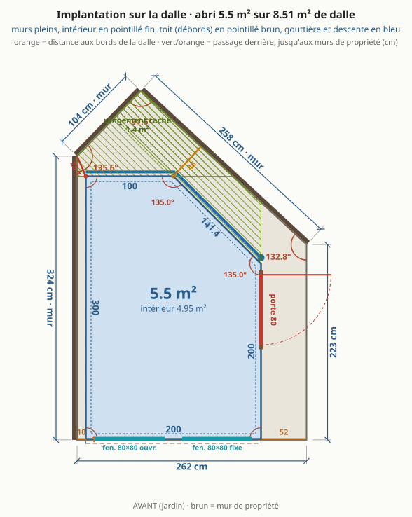
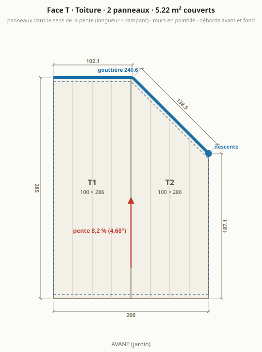
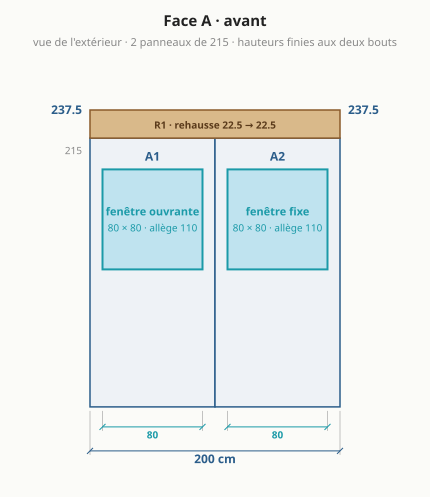
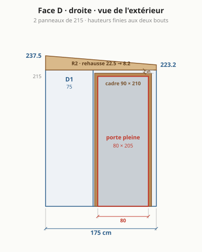
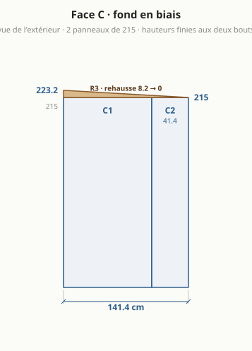
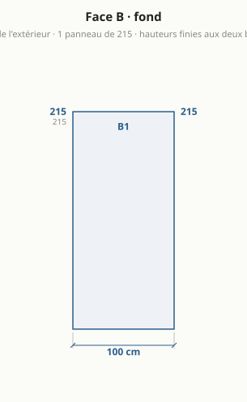
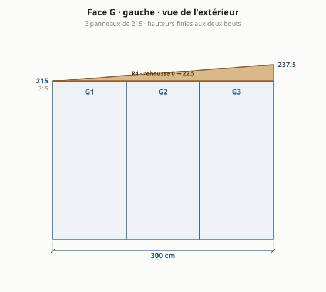
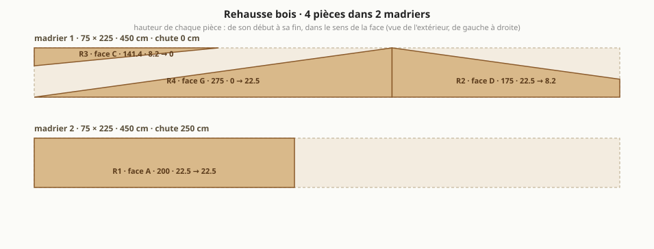

# Abri de jardin : le bureau à cinq murs, version 4 (toit vers le fond, gouttière derrière)

> Généré par `npm run emit` depuis `params.json` (bloc `abri_v4`) et `site/src/compute.ts` : ne pas éditer à la main. Version de départ : [abri-v3.md](abri-v3.md). Autres formes étudiées : [variantes.md](variantes.md).

## Ce qui change par rapport à la version 3

| | version 3 ([abri-v3.md](abri-v3.md)) | **version 4** |
|---|---|---|
| murs (extérieur) | 5,5 m² | 5,5 m² |
| intérieur | **4,95 m²** | **4,95 m²** |
| emprise au sol (débords de toit exclus, R*420-1) | 5,5 m² | 5,5 m² |
| formalités (seuils 5 puis 20 m²) | déclaration préalable | déclaration préalable |
| murs | 5 : A 200 · D 200 · C 141,4 · B 100 · G 300 cm | 5 : A 200 · D 200 · C 141,4 · B 100 · G 300 cm |
| angles | 90° · 90° · 135° · 135° · 90° | 90° · 90° · 135° · 135° · 90° |
| faces en panneaux entiers | A, D, B, G | A, D, B, G |
| bandes de mur de moins de 30 cm | 0 | 0 |
| panneaux de mur à commander | 10 | 10 |
| passage derrière l'abri | 46 cm | 46 cm |
| sens du toit | vers la droite (jardin) | vers le fond (mur de propriété) |
| pente | 11,2 % (6,42°), chute 22,5 cm | 7,5 % (4,29°), chute 22,5 cm |
| portée du toit sans panne | 2 m | 3 m |
| panneaux de toit | 3, dont 2 coupé(s) en biais et 0 de moins de 30 cm de large | 2, dont 1 coupé(s) en biais et 0 de moins de 30 cm de large |
| gouttière et descente | 347,6 cm sur D + C, descente devant à droite, côté jardin | 240,6 cm sur C + B, descente à l'arrière du mur droit, à l'entrée du passage |
| rehausse | 4 pièces, 2 madrier(s) 75 × 225 | 4 pièces, 2 madrier(s) 75 × 225 |
| hauteurs finies des coins | 237,5 · 215 · 215 · 226,2 · 237,5 cm | 237,5 · 237,5 · 222,5 · 215 · 215 cm |
| espace caché derrière l'abri | 1,4 m², jusqu'à 97 cm de profondeur | 1,4 m², jusqu'à 97 cm de profondeur |
| porte | pleine, 80 × 205, débord de toit au-dessus : 15 cm | pleine, 80 × 205, débord de toit au-dessus : 0 cm |
| fenêtres en façade | 80 ouvrante + 80 fixe | 80 ouvrante + 80 fixe |
| sol libre hors bureaux | 2,58 m² | 2,58 m² |
| lit | 75 × 190, pliant, posé au sol libre | 75 × 190, pliant, posé au sol libre |
| budget indicatif HT | 3 761 € (coque 3 158 €) | 3 781 € (coque 3 178 €) |

### Ce que cette disposition apporte

- **Une façade droite et haute** : 237,5 cm d'un bout à l'autre, le toit ne se voit pas pencher depuis le jardin ni depuis la maison. Dans la version 3 la façade descend de 237,5 à 215 cm vers la porte.
- **La gouttière est derrière, invisible** : 240.6 cm le long du mur du fond puis du pan à 45°. Les nervures des panneaux de toit vont de l'avant vers l'arrière, toute l'eau arrive donc aux bouts arrière des panneaux, et nulle part ailleurs.
- **Un panneau de toit en moins** : 2 panneaux au lieu de 3, dans le sens de la profondeur, sans bande étroite. Un seul porte une coupe en biais, le long du pan à 45°.
- **Le mur contre la propriété n'est plus le mur haut** : il descend de 237,5 cm devant à 215 cm au fond, au lieu de rester à 237,5 cm sur ses trois mètres. Moins de mur visible au-dessus du mur du voisin.
- Débord de 5 cm devant : il protège un peu les fenêtres de façade, que la version 3 laisse à nu.

### Ce que la version 4 perd

- **Portée du toit : 3 m au lieu de 2 m.** Les panneaux vont de la façade au mur du fond. C'est l'hypothèse la plus fragile du projet pour du 60 mm : à faire confirmer par le fabricant, ou prévoir une panne en bois en travers, à mi-profondeur (2 m de portée, elle relie aussi le mur gauche au mur droit).
- **Pente 7,5 % au lieu de 11,2 %** : la même chute de 22,5 cm s'étale sur 3 m au lieu de 2 m. C'est peu pour une toiture en panneaux ; une chute de 30 cm donnerait 10 %, mais demande un madrier de 300, introuvable en stock (ou deux pièces superposées).
- **La descente n'a pas de bonne place.** Au coin arrière gauche, le point bas naturel, elle est coincée entre deux murs, hors d'atteinte, et l'eau finit au pied du mur de propriété. Placée à l'arrière du mur droit, à l'entrée du passage, comme ici, elle se trouve dans le passage qu'on veut garder libre, et il faut encore un tuyau le long du mur droit pour amener l'eau au jardin. La version 3 la met devant, côté jardin, sur la dalle.
- **La gouttière du pan à 45° est à contre-pente** : le bord du toit y monte de 7,5 cm vers le mur droit, la gouttière doit descendre dans l'autre sens. Elle pend donc de 8 à 9 cm sous le bord du toit à son bout droit.
- **Plus d'abri au-dessus de la porte** : le débord de 15 cm de la version 3 venait gratuitement de la longueur des panneaux. Ici un débord à droite demande un panneau de toit de plus, refendu. Prévoir une marquise.
- **Gouttière dans le passage** : à 2,05 m du sol environ, au point où le passage fait 46 cm. Avec un débord arrière de 5 cm, le bord du toit et la gouttière avancent d'une quinzaine de centimètres au-dessus du passage : on passe dessous, mais elle se nettoie dans un couloir étroit, pas depuis le jardin.

### Pourquoi

1. **Pourquoi les nervures décident** : un panneau sandwich de toiture a des nervures dans sa longueur, et il se pose nervures dans le sens de la pente. L'eau ne quitte donc le toit que par les bouts bas des panneaux. Toit vers le fond : gouttière au fond, sur les deux bords où finissent les panneaux (mur du fond et pan à 45°). Le modèle applique cette règle à toute forme.
2. **Tout le reste est celui de la version 3** : mêmes cinq murs, même intérieur, même passage, porte pleine sur le côté, deux fenêtres de 80 × 80. Le tableau ne montre que ce que le sens du toit change.

### Conseils que les plans ne montrent pas

- La panne intermédiaire conseillée n'est ni dessinée ni chiffrée : un bois de 75 × 150 environ, 2 m, posé sur les murs gauche et droit.
- Le tuyau qui ramène l'eau de la descente au jardin (2 m le long du mur droit, au sol) n'est pas chiffré non plus.
- Une marquise au-dessus de la porte est à ajouter au budget.

## En bref

- **Dalle existante** : 8,51 m², côtés 262 / 223 / 258 / 104 / 324 cm, murs de propriété à gauche et au fond.
- **4,95 m² intérieur** (5,5 m² de murs), 46 cm de passage derrière.
- **5 murs** en panneaux sandwich 6 cm autoportants : façade 200, droite 200, fond en biais 141,4, fond 100, gauche 300 cm.
- **Toit** mono-pente vers le fond, 4,29° : 237,5 cm devant, 215 cm au plus bas.
- **Porte pleine** 80 × 205 sur le mur droit, **2 fenêtres** en façade, **bureau en L** sur la façade et le mur gauche.
- **Budget indicatif** : 3 214 € à 4 348 € HT (coque 3 178 €, aménagement 603 €).
- **Formalités** : emprise au sol 5,5 m², surface de plancher 4,95 m² ⇒ déclaration préalable.

## À trancher

- **Toit** : vers l'arrière, chute 22,5 cm (4,29°) = choix par défaut. Madrier 75 × 225 classe 4 : section courante, à vérifier en classe 4.
- **Formalités** : emprise au sol **5,5 m²** (les débords de toit, simples et en l'air, n'entrent pas dans l'emprise au sol : Code de l'urbanisme R*420-1), surface de plancher 4,95 m² ⇒ **déclaration préalable** (seuils 5 puis 20 m²). secteur protégé ou abords d'un monument historique : déclaration préalable même sous le seuil ; le PLU (implantation, hauteur, distance aux limites) s'applique dans tous les cas.
- **Lit 75 × 190** : déplié au milieu, fauteuil et tabouret rangés.
- **Portée du toit** (~3 m au plus long) en 6 cm sans panne : à confirmer dans le tableau du fabricant.
- **Angles non droits** (135°, 135°) : profils d'angle pliés sur mesure.

## Plans

### Implantation sur la dalle

### Plan de sol

### Toiture

### Face A · façade (jardin)

### Face D · droite (porte)

### Face C · fond en biais

### Face B · fond

### Face G · gauche

### Rehausse bois : débit des madriers

## Dimensions

| face | longueur ext. | longueur int. | hauteur finie (début → fin) | angle au début |
|---|---|---|---|---|
| A · avant | 200 cm | 188 cm | 237,5 → 237,5 cm | 90° |
| D · droite | 200 cm | 191,5 cm | 237,5 → 222,5 cm | 90° |
| C · fond en biais | 141,4 cm | 136,5 cm | 222,5 → 215 cm | 135° |
| B · fond | 100 cm | 91,5 cm | 215 → 215 cm | 135° |
| G · gauche | 300 cm | 288 cm | 215 → 237,5 cm | 90° |

Murs 5,5 m² · intérieur 4,95 m² (murs de 6 cm retirés) · sol libre hors bureaux 2,58 m² · hauteur sous plafond 2,32 m devant, 2,09 m au plus bas (plancher isolé déduit).

## Débit

### Panneaux de mur (hauteur 215 cm, pose verticale)

| pièce | largeur | provenance | découpe |
|---|---|---|---|
| A1 | 100 cm | panneau entier | fenêtre 80 × 80 |
| A2 | 100 cm | panneau entier | fenêtre 80 × 80 |
| D1 | 100 cm | panneau entier | – |
| D2 | 100 cm | panneau entier | porte 90 × 210 |
| C1 | 100 cm | panneau entier | – |
| C2 | 41,4 cm | panneau recoupé | – |
| B1 | 100 cm | panneau entier | – |
| G1 | 100 cm | panneau entier | – |
| G2 | 100 cm | panneau entier | – |
| G3 | 100 cm | panneau entier | – |

**10 panneaux de mur** de 100 × 215 à commander (les bandes étroites sortent des chutes).

### Panneaux de toit (dans le sens de la pente, longueur = rampant)

| pièce | largeur | longueur à commander | coupe |
|---|---|---|---|
| T1 | 100 cm | 310,9 cm | entier, coupes droites |
| T2 | 100 cm | 310,9 cm | bout arrière en biais |

Débords : 5 cm devant, 5 cm au fond, rives affleurantes sur les côtés. Surface couverte 5,72 m².

### Rehausse bois (madrier 75 × 225, stock 480 cm)

| pièce | face | longueur | hauteur début → fin |
|---|---|---|---|
| R1 | A | 200 cm | 22,5 → 22,5 cm |
| R2 | D | 200 cm | 22,5 → 7,5 cm |
| R3 | C | 141,4 cm | 7,5 → 0 cm |
| R4 | G | 300 cm | 0 → 22,5 cm |

**2 madriers** : n°1 = R4 + R2 puis R3 (chute 38,6 cm) ; n°2 = R1 (chute 280 cm). Deux pièces sur un même tronçon = une seule coupe en biais.

### Gouttière et profils

- Gouttière 240,6 cm derrière l'abri, en 2 tronçon(s) (C 138,5 + B 102,1) : les nervures du toit mènent toute l'eau aux bouts arrière des panneaux. Descente à l'arrière du mur droit, à l'entrée du passage.
- 5 angles : G/A 90°, A/D 90°, D/C 135°, C/B 135°, B/G 90° ; hauteur de chaque angle = hauteur finie du coin.
- Rail de pied sur tout le périmètre (9,41 m), bavettes de rive sur les côtés D et G.

## Ouvertures

| ouverture | taille | où | détail |
|---|---|---|---|
| porte pleine | 80 × 205 (cadre 90 × 210) | face D, de 107,5 à 187,5 cm depuis la façade | ouvre vers l'extérieur ; cadre à 5 cm du mur du fond (face intérieure) et sous le haut du mur |
| fenêtre oscillo-battante | 80 × 80 | face A, de 10 à 90 cm depuis le coin gauche | allège 110 cm, au-dessus du bureau, dans un seul panneau |
| fenêtre fixe | 80 × 80 | face A, de 110 à 190 cm depuis le coin gauche | allège 110 cm, au-dessus du bureau, dans un seul panneau |

## Aménagement

| élément | taille | place |
|---|---|---|
| bureau gauche | 60 × 288 cm | tout le mur gauche |
| bureau de façade | 50 × 188 cm | tout le mur de façade |
| fauteuil de bureau | 70 × 70 cm | devant le bureau gauche |
| tabouret | 30 × 30 cm | devant le bureau de façade |
| lit pliant (déplié) | 75 × 190 cm | au milieu, sièges rangés |

## Budget indicatif (HT, fourniture seule)

| poste | quantité | prix unitaire | montant |
|---|---|---|---|
| Panneaux sandwich mur 60 mm (à commander) | 21,5 m² | 35 € | 752 € |
| Surcoût fixation cachée (mur) | 21,5 m² | 5 € | 108 € |
| Panneaux sandwich toit 60 mm (à longueur) | 6,22 m² | 35 € | 218 € |
| Rehausse bois (madriers 75 × 225) | 9,6 ml | 10 € | 96 € |
| Porte pleine isolée + cadre | 1 u | 450 € | 450 € |
| Fenêtre fixe | 1 u | 200 € | 200 € |
| Fenêtre ouvrante | 1 u | 320 € | 320 € |
| Profils (angles int. + ext., rail de pied, rives) | 37 ml | 12 € | 444 € |
| Visserie + étanchéité | 1 forfait | 160 € | 160 € |
| Gouttière + descente | 1 forfait | 130 € | 130 € |
| Ventilation | 1 forfait | 150 € | 150 € |
| Livraison des panneaux | 1 forfait | 150 € | 150 € |
| Plancher isolé | 4,95 m² | 45 € | 223 € |
| Électricité (multiprise, éclairage) | 1 forfait | 80 € | 80 € |
| Chauffage | 1 forfait | 120 € | 120 € |
| Store | 1 forfait | 60 € | 60 € |
| Finition intérieure | 1 forfait | 120 € | 120 € |
| **coque** | | | **3 178 €** |
| **aménagement** | | | **603 €** |
| **total** | | | **3 781 €** (3 214 € à 4 348 €, ±15 %) |

Prix médians du marché, à confirmer par devis (`prix_indicatifs_eur`). Porte et fenêtres au prix des blocs standard.
