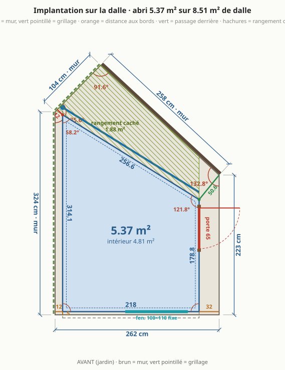
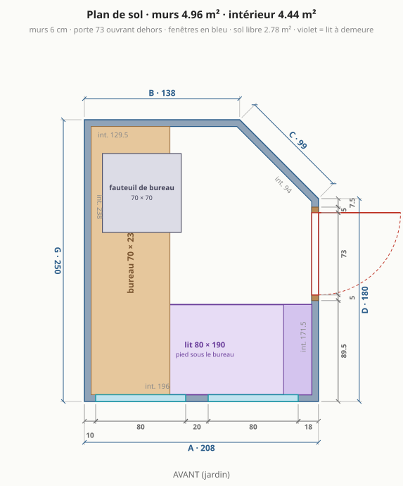
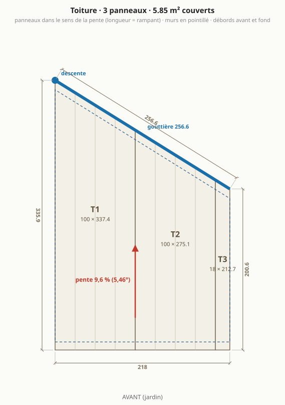
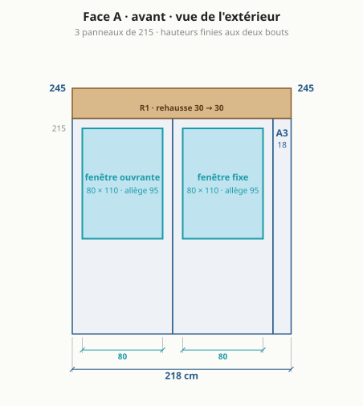
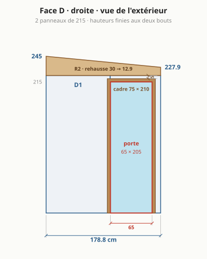
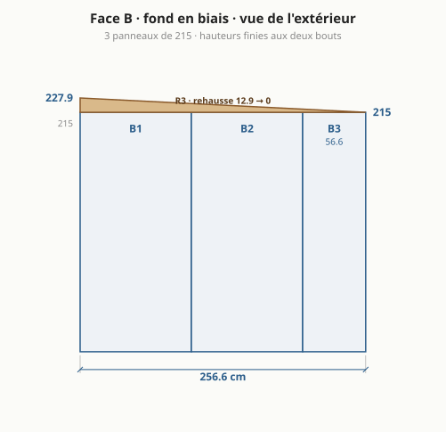
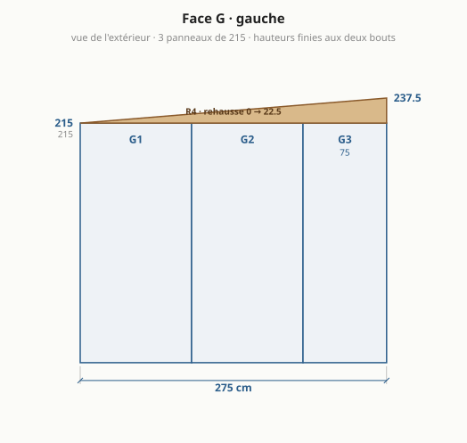
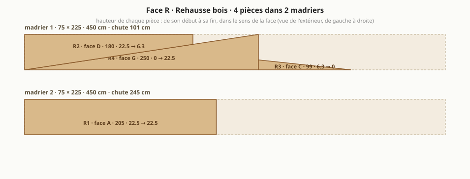

# Abri de jardin : le bureau à cinq murs

> Généré par `npm run emit` depuis `params.json` et `site/src/compute.ts` : ne pas éditer à la main. Études archivées et autres formes étudiées : [etudes/variantes.md](etudes/variantes.md).

## En bref

- **Dalle existante** : 8,51 m², côtés 262 / 223 / 258 / 104 / 324 cm, murs de propriété à gauche et au fond.
- **4,44 m² intérieur** (4,95 m² de murs), 54,9 cm de passage derrière.
- **5 murs** en panneaux sandwich 6 cm autoportants : façade 208, droite 180, fond en biais 100, fond 136,6, gauche 250 cm.
- **Toit** mono-pente vers le fond, 5,03° : 241,5 cm devant, 219,5 cm au plus bas.
- **Porte pleine** 70 × 200 sur le mur droit, **2 fenêtres** en façade, **bureau** sur le mur gauche, **lit 80 × 190** à demeure le long de la façade.
- **Matériaux** : 2 966 € TTC (2 521 € à 3 411 €), sans main-d'œuvre ni livraison ; équipement optionnel 200 €.

- **Formalités** : emprise au sol 4,95 m², surface de plancher 4,44 m² ⇒ aucune formalité.

## À trancher

- **Pente** (8,8 %, 5,03°) : à confirmer par le fabricant des panneaux de toit.
- **Portée du toit** (~2,5 m au plus long) en 6 cm sans panne : à confirmer dans le tableau du fabricant.

## Plans

### Implantation sur la dalle

### Plan de sol

### Toiture

### Face A · façade (jardin)

### Face D · droite (porte)

### Face C · fond en biais

### Face B · fond

### Face G · gauche

### Rehausse bois : débit des madriers

## Dimensions

| face | longueur ext. | longueur int. | hauteur finie (début → fin) | angle au début |
|---|---|---|---|---|
| A · avant | 208 cm | 196 cm | 241,5 → 241,5 cm | 90° |
| D · droite | 180 cm | 171,5 cm | 241,5 → 225,7 cm | 90° |
| C · fond en biais | 100 cm | 95 cm | 225,7 → 219,5 cm | 134,4° |
| B · fond | 136,6 cm | 128,1 cm | 219,5 → 219,5 cm | 135,6° |
| G · gauche | 250 cm | 238 cm | 219,5 → 241,5 cm | 90° |

Murs 4,95 m² · intérieur 4,44 m² (murs de 6 cm retirés) · sol libre hors bureaux 2,77 m² · hauteur sous plafond 2,33 m au plus haut, 2,1 m au plus bas (plancher isolé déduit).

## Débit

### Panneaux de mur (hauteur 215 cm, pose verticale)

| pièce | largeur | provenance | découpe |
|---|---|---|---|
| A1 | 115 cm | panneau entier | fenêtre 80 × 75 |
| A2 | 93 cm | panneau recoupé | fenêtre 80 × 75 |
| D1 | 65 cm | panneau recoupé | – |
| D2 | 115 cm | panneau entier | porte 70 × 209 |
| C1 | 100 cm | panneau recoupé | – |
| B1 | 115 cm | panneau entier | – |
| B2 | 21,6 cm | chute d'un autre panneau | – |
| G1 | 115 cm | panneau entier | – |
| G2 | 115 cm | panneau entier | – |
| G3 | 20 cm | chute d'un autre panneau | – |

**8 panneaux de mur** à commander, 8 de 115 × 215 (les bandes étroites sortent des chutes).

### Panneaux de toit (dans le sens de la pente, longueur = rampant)

| pièce | largeur | longueur à commander | coupe |
|---|---|---|---|
| T1 | 115 cm | 261 cm | entier, coupes droites |
| T2 | 93 cm | 261 cm | refendu en largeur, bout arrière en biais |

Débords : 5 cm devant, 5 cm au fond, rives affleurantes sur les côtés. Surface couverte 5,17 m².

### Rehausse bois (madrier 70 × 220, stock 450 cm)

| pièce | face | longueur | hauteur début → fin |
|---|---|---|---|
| R1 | A | 208 cm | 22 → 22 cm |
| R2 | D | 180 cm | 22 → 6,2 cm |
| R3 | C | 100 cm | 6,2 → 0 cm |
| R4 | G | 250 cm | 0 → 22 cm |

**2 madriers** : n°1 = R4 + R3 puis R2 (chute 20 cm) ; n°2 = R1 (chute 242 cm). Deux pièces sur un même tronçon = une seule coupe en biais.

### Lisse haute et seuil (lambourde 70 × 45, stock 450 cm)

À plat sur la tête de chaque mur, coupée d'onglet aux angles : L1 (A, 208 cm), L2 (D, 180 cm), L3 (C, 100 cm), L4 (B, 136,6 cm), L5 (G, 250 cm). La rehausse se visse dessus, et au fond le bas du toit porte sur elle. Seuil de porte : 2 épaisseurs de 70 cm, soit 9 cm, au niveau du plancher. **3 lambourdes**.

### Gouttière et profils

- Gouttière 235,8 cm derrière l'abri, en 2 tronçon(s) (C 97,1 + B 138,6) : les nervures du toit mènent toute l'eau aux bouts arrière des panneaux. Descente au coin arrière gauche.
- 5 angles : G/A 90°, A/D 90°, D/C 134,4°, C/B 135,6°, B/G 90° ; hauteur de chaque angle = hauteur finie du coin.
- Cornières de pied, dedans et dehors, sur tout le périmètre (8,75 m), bavettes de rive sur les côtés D et G.

## Ouvertures

| ouverture | taille | où | détail |
|---|---|---|---|
| porte pleine | 70 × 200 | face D, de 97,5 à 167,5 cm depuis la façade | ouvre vers l'extérieur ; dormant à 10 cm du mur du fond (face intérieure) ; posée sur un seuil de 9 cm, au niveau du plancher |
| fenêtre oscillo-battante | 80 × 75 | face A, de 17,5 à 97,5 cm depuis le coin gauche | allège 115 cm, au-dessus du bureau, dans un seul panneau |
| fenêtre oscillo-battante | 80 × 75 | face A, de 121,5 à 201,5 cm depuis le coin gauche | allège 115 cm, au-dessus du bureau, dans un seul panneau |

## Aménagement

| élément | taille | place |
|---|---|---|
| bureau gauche | 70 × 238 cm | tout le mur gauche |
| fauteuil de bureau | 70 × 70 cm | devant le bureau gauche |
| lit à demeure | 80 × 190 cm | le long de la façade, tête côté porte, pied sous le bureau |

## Matériaux à acheter (prix TTC, sans main-d'œuvre, sans livraison)

### Panneaux · 1 140 €

| matériau | quantité | prix unitaire | montant | comment c'est compté, d'où vient le prix |
|---|---|---|---|---|
| Panneaux sandwich de mur 60 mm, 115 × 215 cm (tous les murs) *(prix à confirmer)* | 19,78 m² | 44 € | 870 € | 8 panneau(x) entier(s) de 115 à commander (les bandes recoupées sortent des chutes). fixation cachee PIR 60 mm : 37,80 EUR/m2 par paquet entier ; 40 a 50 EUR/m2 en petite quantite ou au detail (negoce). La plupart des vendeurs en ligne imposent 100 m2 ou un paquet de 12 panneaux de 6 m. ([source](https://www.panelsell.fr/articles-en-stock-panneaux-de-toiture-bardage/panneaux-sandwichs-bardage-fixation-cachee-60-mm-lw-70)) |
| Panneaux sandwich de toiture 60 mm, nervurés, teinte claire *(prix à confirmer)* | 6 m² | 45 € | 270 € | 2 panneaux coupés à longueur : T1 261 cm, T2 261 cm. 35,40 EUR/m2 par paquet de 10 ; 34,20 chez toleacier.fr en longueurs de stock ; jusqu'a 71 EUR/m2 au detail en negoce (Ondatherm). Teinte claire RAL 9010 disponible sur commande. ([source](https://www.panelsell.fr/articles-en-stock-panneaux-de-toiture-bardage/panneaux-sandwich-toiture-60-mm-lw-128)) |

### Bois · 189 €

| matériau | quantité | prix unitaire | montant | comment c'est compté, d'où vient le prix |
|---|---|---|---|---|
| Lambourde 70 × 45 classe 4 (lisse haute à plat sur chaque mur, seuil de porte) | 13,5 ml | 4 € | 57 € | 3 pièce(s) de 450 cm : une lisse par mur (8,75 m), plus 2 épaisseurs de seuil. lambourde pin classe 4 70 x 45 : 18,90 EUR les 4,5 m, 12,90 EUR les 3 m ; Brico Depot la vend aussi en 2,7 et 3 m ([source](https://www.depotbois.com/product-page/lambourde-pin-classe-4-70x45mm)) |
| Madrier 70 × 220 classe 4 (rehausse) | 9 ml | 15 € | 132 € | 2 pièce(s) de 450 cm. classe 4 : la section en stock est 70 x 220 (58,80 EUR les 4 m, 66 EUR les 4,5 m). Le 75 x 225 n'existe en stock qu'en classe 2 (environ 10 EUR/m). ([source](https://www.boidiscount.com/index.php?p=1_190_PRIX-BASTAINGS-MADRIERS-BOIS-D-OSSATURE.-TRAIT-AUTOCLAVE-CLASSE-4)) |

### Profils et bavettes · 543 €

| matériau | quantité | prix unitaire | montant | comment c'est compté, d'où vient le prix |
|---|---|---|---|---|
| Cornières alu 40 × 40 (pied des murs, dedans et dehors) | 16,09 ml | 10 € | 160 € | deux cornières sur le périmètre des murs moins la porte : le panneau se pose entre elles. corniere alu brut 40 x 40 x 1,5 mm, 2,50 m : 24,90 EUR ([source](https://www.castorama.fr/corniere-aluminium-brut-40-x-40-x-1-5-mm-2-50-m/3232637727754_CAFR.prd)) |
| Profils d'angle à 90°, extérieur + intérieur | 14,05 ml | 10 € | 141 € | 3 angles droits, hauteur finie de chaque coin, deux faces. 7,92 EUR HT le metre, tole 0,75 mm ([source](https://www.panelsell.fr/profiles-plies-pour-panneaux-sandwichs-sur-mesure/profile-d-angle-exterieur)) |
| Profils d'angle pliés sur mesure (134,4°, 135,6°), extérieur + intérieur *(prix à confirmer)* | 8,9 ml | 15 € | 134 € | 2 angles non droits, deux faces, commandés pliés avec les panneaux. aucun prix public pour un pliage a 135 degres : estimation d'apres le profil standard, a faire chiffrer avec les panneaux (sinon un atelier de tolerie local plie des bandes plates) ([source](https://www.panelsell.fr/profiles-plies-pour-panneaux-sandwichs-sur-mesure/profile-d-angle-exterieur)) |
| Bandes de rive de toit | 4,52 ml | 14 € | 63 € | bords du toit parallèles à la pente. 12,90 EUR/m en longueurs de 2,1 m ([source](https://www.yousteel.fr/pliages-accessoires/180-bande-de-rive-universelle-2100m.html)) |
| Bavette de tête (bord haut du toit) | 2,08 ml | 14 € | 29 € | bord haut du toit. solin ou faitiere 2,10 m : 29 EUR ([source](https://www.mastock.fr/toiture/846-1506-accessoires-tole-bac-acier.html)) |
| Closoirs mousse sous les nervures *(prix à confirmer)* | 4,44 ml | 4 € | 16 € | bord haut + bord d'égout. rouleau de 6 m de 11,90 a 21,90 EUR ; le profil doit correspondre aux nervures du panneau choisi ([source](https://www.leroymerlin.fr/produits/closoir-mousse-pour-plaque-acier-6-m-66887583.html)) |

### Fixations · 108 €

| matériau | quantité | prix unitaire | montant | comment c'est compté, d'où vient le prix |
|---|---|---|---|---|
| Vis autoperceuses de toiture à rondelle, longues (panneau + nervure dans le bois) | 0,18 cent | 90 € | 16 € | 2 panneaux × 2 appuis × 4 vis, +10 %. inox 6,5 x 145 a rondelle EPDM : 89,99 EUR le cent. Longueur = panneau + nervure + 50 mm dans le bois. ([source](https://www.wovar.fr/vis-pour-panneaux-sandwich-inox/)) |
| Vis de couture (recouvrements de panneaux, bavettes, profils) | 0,64 cent | 35 € | 22 € | un recouvrement tous les 40 cm, une bavette tous les 30 cm, +10 %. 4,8 x 20 : de 24 a 45 EUR le cent ([source](https://www.toletome.fr/les-produits-tole-to-me/accessoires-de-fixation/visserie/vis-de-couture-en-acier-(4-8-x-20).html)) |
| Vis autoperceuses de panneaux de mur (pied et tête) | 0,53 cent | 90 € | 48 € | 8 panneaux × 2 extrémités × 3 vis, +10 %. vis 6,3 x 100 + rondelle + cache de couleur ([source](https://www.tolesmoinscheres.com/produit/100-fixations-pour-panneau-sandwich-de-bardage)) |
| Chevilles ou goujons pour fixer les cornières de pied dans la dalle | 40 u | 1 € | 22 € | une tous les 50 cm, sur chacune des deux cornières. goujons 8 x 80 : 55,90 EUR la boite de 100 ([source](https://www.toutbrico.com/goujons-d-ancrage/7242-boite-100-goujons-d-ancrage-8-x-80mm-zingue-batifix-3700013413404.html)) |

### Étanchéité · 168 €

| matériau | quantité | prix unitaire | montant | comment c'est compté, d'où vient le prix |
|---|---|---|---|---|
| Bande d'arase sous le pied des murs | 8,75 ml | 1 € | 5 € | périmètre des murs. rouleau de 30 m x 30 cm : 16,90 EUR ([source](https://www.bricodepot.fr/catalogue/bande-darase-long-30-m-larg-30-cm-500-microns/prod59812/)) |
| Bande butyle (joints de panneaux, tête de mur sous la lisse) | 22 ml | 2 € | 33 € | 5 joints de mur × 2,2 m + périmètre + recouvrements de toit. rouleau de 13 m : 19,66 EUR ([source](https://tolganor.fr/produit/joint-butyl-pour-etancheite-rouleau-de-13-ml-etanco/)) |
| Mastic polyuréthane ou MS polymère, cartouches | 4 cartouche | 9 € | 36 € | une cartouche pour 8 m de cordon : pied de mur dedans et dehors, tour des ouvertures. MS polymere de 6,50 a 13 EUR ; Sikaflex 11FC environ 11,50 EUR ([source](https://www.maxoutil.com/mastic-ms-polymere-parabond-600-dl-chemicals-cartouche-de-290-ml-40001000.html)) |
| Bande comprimée au pourtour des ouvertures *(prix à confirmer)* | 10,9 ml | 7 € | 76 € | tour de la porte et des fenêtres. rouleau de 5 m : 44 EUR en negoce, moins cher ailleurs ([source](https://www.pointp.fr/p/couverture/bande-mousse-impregnee-bitume-20x30-rouleau-de-5m-A3242825)) |
| Mousse polyuréthane expansive, bombes | 2 bombe | 9 € | 18 € | calfeutrement des ouvertures et des angles. 750 ml : de 7,90 a 9,90 EUR ([source](https://www.bricodepot.fr/produits/materiau-et-gros-oeuvre/isolation-et-cloison/etancheite/mousse-expansive)) |

### Ouvertures · 437 €

| matériau | quantité | prix unitaire | montant | comment c'est compté, d'où vient le prix |
|---|---|---|---|---|
| Bloc-porte plein 70 × 200 cm, avec dormant *(prix à confirmer)* | 1 u | 199 € | 199 € | une porte. bloc-porte de service EXTERIEUR en PVC, plein, 70 x 200 hors tout, dormant compris : Brico Depot le fait en 70, 80 ou 90 de large et 200 ou 205 de haut (https://www.bricodepot.fr/catalogue/construction-renovation/fenetre-porte-escalier/porte-dentree-interieure-garage/porte-de-service/). Prix du 80 x 205 (199 EUR) : celui du 70 est a relever en magasin. Choisir un modele a serrure multipoint. |
| Fenêtre oscillo-battante PVC double vitrage 80 × 75 cm | 2 u | 119 € | 238 € | fenêtres ouvrantes. taille de stock 80 x 75 (2 vantaux, Uw 1,2), sans delai ; hors tout 85 x 78 ; poignee vendue a part ([source](https://www.bricodepot.fr/catalogue/fenetre-pvc-blanc-oscillo-battante-2-vantaux-h75-x-l80-cm/prod75983/)) |

### Eaux pluviales · 79 €

| matériau | quantité | prix unitaire | montant | comment c'est compté, d'où vient le prix |
|---|---|---|---|---|
| Gouttière demi-ronde | 2,36 ml | 5 € | 11 € | 2 tronçon(s) : C 97,1 cm + B 138,6 cm. PVC demi-ronde de 25 : 9,40 EUR les 2 m (zinc : 22,50 EUR les 2 m) ([source](https://www.bricodepot.fr/produits/materiau-et-gros-oeuvre/gros-oeuvre-et-evacuation-des-eaux/evacuation-des-eaux-de-pluie/gouttiere-pvc)) |
| Crochets de gouttière | 6 u | 2 € | 12 € | un tous les 50 cm ([source](https://www.brico-toiture.com/175-gouttiere-pvc-25-80-gris)) |
| Naissance, fonds, angle, coudes et colliers (lot) | 1 lot | 45 € | 45 € | un angle, une naissance, deux fonds, deux coudes, deux colliers. naissance 14 + 2 fonds 6 + jonction ou angle 5 + 2 coudes 11 + 3 colliers 8 ([source](https://www.brico-toiture.com/175-gouttiere-pvc-25-80-gris)) |
| Tuyau de descente | 2,19 ml | 5 € | 11 € | hauteur du mur côté égout. tube de 80 : 10 EUR les 2 m ([source](https://www.brico-toiture.com/175-gouttiere-pvc-25-80-gris)) |

### Plancher isolé · 223 €

| matériau | quantité | prix unitaire | montant | comment c'est compté, d'où vient le prix |
|---|---|---|---|---|
| Film polyéthylène sur la dalle | 5,11 m² | 1 € | 5 € | surface intérieure, +15 % de recouvrements. rouleau de 20 m2 : 19,90 EUR ([source](https://www.bricodepot.fr/catalogue/rouleau-pare-vapeur-ep-015-mm-20-m-l-200cm-x-l-1000cm/prod90796/)) |
| Isolant XPS 60 mm, posé à joints serrés sur le film | 4,66 m² | 12 € | 54 € | surface intérieure, +5 %. XPS 60 mm rainure, 1,25 x 0,60 : 8,63 EUR le panneau ([source](https://www.bricodepot.fr/p/8437007530070/panneau-de-polystyrene-extrude-xps-l-1-25-x-l-0-60-m-ep-60-mm)) |
| Dalles OSB3 22 mm rainurées, collées aux rainures | 4,88 m² | 15 € | 73 € | surface intérieure, +10 % de chutes. dalle OSB3 22 mm rainuree 4 cotes, 250 x 67,5 : 25,14 EUR (9,99 EUR/m2 chez Brico Depot, rainure non confirmee) ([source](https://www.castorama.fr/dalle-lisse-osb3-250-x-67-5-cm-x-ep-22-mm-isb/3534691922190_CAFR.prd)) |
| Colle à bois D3 pour les rainures | 1 u | 18 € | 18 € | un flacon de 750 g pour 10 m² de dalles. colle vinylique D3, 750 g ([source](https://www.castorama.fr/colle-sader-vinylique-bois-pro-d3-750g/3549212468682_CAFR.prd)) |
| Revêtement de sol (vinyle ou stratifié) | 4,88 m² | 15 € | 73 € | surface intérieure, +10 % de chutes. vinyle rigide a clipser ; stratifie des 5 EUR/m2 ([source](https://www.bricodepot.fr/produits/carrelage-stratifie-et-parquet/stratifie-parquet-et-sol-vinyle-pvc)) |

### Ventilation · 12 €

| matériau | quantité | prix unitaire | montant | comment c'est compté, d'où vient le prix |
|---|---|---|---|---|
| Grilles ou entrées d'air murales, avec moustiquaire | 2 u | 6 € | 12 € | une basse, une haute, sur deux murs opposés. grille alu a persiennes avec moustiquaire, 100 x 100 ; un extracteur hygroreglable coute 95 EUR ([source](https://www.castorama.fr/grille-d-aeration-aluminium-autogyre-a-persiennes-avec-moustiquaire-blanche-100-x-100-mm/3127609810100_CAFR.prd)) |

### Équipement (optionnel) · 200 €

| matériau | quantité | prix unitaire | montant | comment c'est compté, d'où vient le prix |
|---|---|---|---|---|
| Goulotte électrique 2 m | 3 u | 15 € | 45 € | la moitié du périmètre, en longueurs de 2 m. 60 x 40, longueur de 2 m ([source](https://www.bricodepot.fr/produits/electricite/installation-electrique/goulotte-plinthe-et-moulure-electrique/goulotte-electrique)) |
| Multiprise parafoudre *(prix à confirmer)* | 1 u | 20 € | 20 € | sur le câble déjà en place. pas de prix lu, 15 a 30 EUR |
| Réglette ou plafonnier LED | 1 u | 10 € | 10 € | un point lumineux. reglette LED 120 cm 36 W : 6,90 EUR ([source](https://www.bricodepot.fr/p/3501709011368/reglette-led-etanche-36w-120-cm-blanc-neutre-4000k-2400-lm-ip65)) |
| Radiateur panneau 750 W à thermostat | 1 u | 65 € | 65 € | bureau chauffé toute l'année. panneau acier 750 W, thermostat, detection de fenetre ouverte ([source](https://www.bricodepot.fr/catalogue/radiateur-acier-jaina-blanc-750-w/prod87074/)) |
| Stores des fenêtres de façade *(prix à confirmer)* | 2 u | 30 € | 60 € | un par fenêtre. pas de prix releve |

### Consommables · 67 €

| matériau | quantité | prix unitaire | montant | comment c'est compté, d'où vient le prix |
|---|---|---|---|---|
| Lame de scie circulaire pour métal (coupe à froid des panneaux) | 1 u | 67 € | 67 € | jamais de meuleuse : elle brûle le laquage et la mousse. Bosch Expert for Sandwich Panel, 36 dents ([source](https://clickoutil.com/lame-scie-circulaire/142169-lames-de-scies-circulaires-expert-for-sandwich-panel-bosch.html)) |

**Total des matériaux : 2 966 € TTC** (fourchette 2 521 € à 3 411 €, ±15 %). Équipement optionnel en plus : 200 €. Hors total : Livraison des panneaux (service, hors total) ≈ 250 €.

Prix relevés chez des marchands français (`prix_materiaux_eur_ttc` dans `params.json`, source notée pour chacun) ; les quantités se recalculent avec l'abri.

## Guide de montage

### Avant de commander

- Faire confirmer par le fournisseur la **largeur utile** des panneaux (115 cm ici) : tout le calepinage en dépend.
- **Acheter des panneaux en petite quantité est le vrai sujet.** Les vendeurs en ligne les moins chers imposent 100 m² ou un paquet entier de panneaux de 6 à 7,5 m. Demander un devis « coupé à longueur, petite quantité » à deux spécialistes et à un négoce local, qui vend au panneau mais plus cher. Sinon acheter des longueurs de stock et les recouper sur place : compter alors plus de surface que le débit.
- Rehausse : madrier 70 × 220 **classe 4** (autoclave, pour l'extérieur), en longueurs de 450 cm : c'est la section vendue en stock dans cette classe.
- Fenêtres et porte sont des articles de stock, sans délai : la découpe des panneaux se fait aux cotes hors tout lues sur l'article reçu, pas aux cotes nominales.
- Faire confirmer la **portée** admise du panneau de toit de 6 cm : 2,5 m ici ; et la **pente minimale** (8,8 % ici ; ArcelorMittal admet 5 % pour des panneaux d'une seule longueur, sans pénétration ni recouvrement en bout).
- Commander les panneaux de toit **coupés à longueur**, et avec les panneaux les profils d'angle droits et les profils des angles de 134,4° et 135,6° **pliés sur mesure**.
- Prévoir deux personnes pour lever les murs et poser le toit, et une journée sans vent : un panneau de 2 m² est une voile.

### Outillage

- Scie circulaire avec **lame pour métal** (coupe à froid) et rail de guidage ; scie sauteuse lame métal pour les angles des ouvertures. **Pas de meuleuse** : elle brûle le laquage et la mousse, et ses étincelles piquent la tôle.
- Visseuse à choc avec douilles 8 mm, perforateur et foret béton, cordeau à tracer, mètre de 5 m, niveau de 1,20 m ou laser, grande équerre, fil à plomb.
- Pistolet à mastic, cutter, serre-joints, 4 étais ou chevrons pour tenir les murs pendant le montage, échelle ou escabeau stable.
- Gants anti-coupure, lunettes, protection auditive. Les rives de tôle coupent.

### Étape 1 · Tracer l'abri sur la dalle

Tout le reste s'aligne sur ce tracé : dix minutes de plus ici évitent un mur qui ne ferme pas.

**Outils :** cordeau, mètre, grande équerre

1. Tracer la façade à 5 cm du bord avant de la dalle et le mur gauche à 10 cm du bord gauche.
2. Reporter les 5 murs dans l'ordre : A 208 cm, D 180 cm, C 100 cm, B 136,6 cm, G 250 cm.
3. Angles, dans le même ordre : 90°, 90°, 134,4°, 135,6°, 90°.

**À contrôler avant de continuer :**

- [ ] Diagonales du tracé : coin avant gauche → haut du mur droit = 275,1 cm ; coin avant droit → coin arrière gauche = 325,2 cm.
- [ ] Passage derrière l'abri : 54,9 cm au plus étroit, à mesurer une fois le tracé fait.

### Étape 2 · Poser les cornières de pied

Deux cornières alu tiennent le pied de chaque panneau, dehors et dedans : un rail en U fait sur place, qui se coupe à n'importe quel angle.

**Outils :** perforateur, visseuse, scie à onglet lame alu, niveau

1. Dérouler la bande d'arase sur le tracé (8,75 m), poser la **cornière extérieure** dessus, aile debout dehors, **nu extérieur sur le trait**.
2. Couper les cornières d'onglet à chaque angle (la moitié de l'angle du mur), cheviller tous les 50 cm, et à 10 cm de chaque angle.
3. Interrompre les cornières sur la largeur de la porte (70 cm, face D).
4. Cordon de mastic continu entre la cornière et la dalle, côté extérieur.
5. Les **cornières intérieures** se posent avec les murs : chacune serrée contre le pied des panneaux, donc à 6 cm de l'extérieure sans avoir à mesurer.

**À contrôler avant de continuer :**

- [ ] Cornières de niveau : caler si la dalle a plus de 5 mm de faux niveau sur un mur.
- [ ] Angles conformes au tracé avant de cheviller le dernier mur.

### Étape 3 · Préparer toutes les coupes à plat

Un panneau se coupe bien sur tréteaux, mal une fois debout.

**Outils :** scie circulaire lame métal, rail de guidage, scie sauteuse

1. Bandes de mur : A2 93 cm, D1 65 cm, C1 100 cm, B2 21,6 cm, G3 20 cm. Couper dans la longueur, face laquée vers le bas, et garder les chutes : elles fournissent les autres bandes.
2. Fenêtres : 80 × 75 cm, bas à 115 cm ; 80 × 75 cm, bas à 115 cm, une par panneau, jamais sur un joint. Percer les quatre angles, puis couper à la scie sauteuse.
3. Toit : T2 à couper en biais d'après le plan de toiture.
4. Lisse haute : L1 (mur A, 208 cm), L2 (mur D, 180 cm), L3 (mur C, 100 cm), L4 (mur B, 136,6 cm), L5 (mur G, 250 cm), coupées d'onglet à la moitié de chaque angle ; seuil : 2 pièces de 70 cm.
5. Rehausse : R1 (mur A, 208 cm, 22 → 22 cm), R2 (mur D, 180 cm, 22 → 6,2 cm), R3 (mur C, 100 cm, 6,2 → 0 cm), R4 (mur G, 250 cm, 0 → 22 cm), tirées de 2 madrier(s) selon le plan de débit.

**À contrôler avant de continuer :**

- [ ] Retirer le film de protection des panneaux au fur et à mesure : après quelques semaines au soleil il ne part plus.
- [ ] Ébavurer chaque coupe et passer une retouche de peinture sur la tôle mise à nu.

### Étape 4 · Monter le mur gauche à plat, puis le lever

À 10 cm du grillage de la limite aucune visseuse ne passe : ce mur se fait au sol.

**Outils :** visseuse, serre-joints, 2 personnes, étais

1. Assembler G1 (115), G2 (115), G3 (20) à plat, butyle dans chaque joint, et visser dessus leur lisse puis leur pièce de rehausse.
2. Placer la bande de 20 cm côté façade, la seule extrémité qu'on atteindra ensuite.
3. Lever le mur à deux, le poser contre la cornière extérieure, le tenir par deux étais vissés dans la rehausse.
4. Poser la cornière intérieure contre le pied, la cheviller et la visser dans la tôle : dehors, la cornière déjà posée tient le pied, aucune vis n'est à faire côté grillage.

**À contrôler avant de continuer :**

- [ ] Aplomb dans les deux sens avant de lâcher les étais.
- [ ] Vide de 10 cm régulier sur toute la longueur.

### Étape 5 · Monter les autres murs

On tourne dans un seul sens pour que chaque panneau s'emboîte dans le précédent.

**Outils :** visseuse, niveau, étais

1. Mur B (fond, 136,6 cm) : B1 (115), B2 (21,6).
2. Mur C (fond en biais, 100 cm) : C1 (100).
3. Mur D (droite, 180 cm) : D1 (65), D2 (115), en laissant le vide du cadre de porte.
4. Mur A (façade, 208 cm) : A1 (115), A2 (93).
5. Butyle dans chaque emboîtement, panneau serré contre le précédent, pied pris entre les deux cornières et vissé dans chacune.
6. Étayer chaque mur tant que la lisse n'est pas posée : avant elle, rien ne tient les têtes.

**À contrôler avant de continuer :**

- [ ] Aplomb de chaque panneau avant de visser le suivant : l'erreur se cumule.
- [ ] Têtes de murs toutes à 215 cm, à 3 mm près, au niveau laser.

### Étape 6 · Fermer les angles

Les profils d'angle lient deux murs et ferment la mousse.

**Outils :** visseuse, mastic

1. Profil extérieur puis intérieur à chacun des 5 angles, vissé tous les 30 cm (vis de couture), mastic sous les deux ailes.
2. Les angles de 134,4° et 135,6° reçoivent les profils pliés sur mesure : les présenter à blanc avant de percer.
3. Bourrer le vide de l'angle à la mousse avant de fermer le profil intérieur.

**À contrôler avant de continuer :**

- [ ] Aucun jour entre profil et panneau : c'est là que l'air et l'eau entrent.
- [ ] Chaque profil sur mesure porte sur ses deux ailes sur toute la hauteur, sans forcer.

### Étape 7 · Poser la lisse haute et la rehausse

La lisse tient la tête de chaque mur, fond compris, et porte le bas du toit ; la rehausse posée dessus donne la pente.

**Outils :** visseuse, serre-joints

1. Poser la lisse à plat sur chaque mur (L1, L2, L3, L4, L5), sur un cordon de butyle en tête de panneaux, et la visser dans la tôle des deux faces tous les 40 cm.
2. Lier les lisses entre elles à chaque angle par deux longues vis en biais.
3. Poser R1 sur A, R2 sur D, R3 sur C, R4 sur G sur la lisse, vissées dedans par-dessus tous les 40 cm.

**À contrôler avant de continuer :**

- [ ] Hauteurs finies des coins : 241,5 · 241,5 · 225,7 · 219,5 · 219,5 cm (dans l'ordre des coins, à partir du coin avant gauche).
- [ ] Dessus de la rehausse dans un même plan : poser une règle d'un mur à l'autre.

### Étape 8 · Couvrir

Nervures dans le sens de la pente, vers le fond : l'eau ne quitte le toit que par le bas des panneaux.

**Outils :** visseuse, 2 personnes, échelle

1. Poser T1 (115 × 261 cm), T2 (93 × 261 cm), en commençant du côté opposé aux vents dominants.
2. Closoirs mousse sous les nervures, en haut et en bas, avant de visser.
3. Visser dans la rehausse (au fond : dans la lisse) par le sommet des nervures, vis longues à rondelle, quatre par panneau et par appui. Serrer jusqu'à écraser la rondelle, pas plus.
4. Recouvrements entre panneaux : butyle, puis vis de couture tous les 40 cm.
5. Bandes de rive sur les bords parallèles à la pente, bavette de tête sur le bord haut.

**À contrôler avant de continuer :**

- [ ] Débords : 5 cm devant, 5 cm au fond, 0 cm à droite, 0 cm à gauche.
- [ ] Ne jamais marcher entre deux appuis : marcher au droit des murs, sur une planche.

### Étape 9 · Gouttière et descente

Recueillir toute l'eau du toit et l'emmener au jardin.

**Outils :** visseuse, niveau, scie à métaux

1. 235,8 cm de gouttière en 2 tronçon(s) : C 97,1 cm + B 138,6 cm.
2. Crochets tous les 50 cm, pente de 5 mm par mètre vers la descente.
3. Descente au bout gauche de la gouttière, au coin arrière gauche, puis un tuyau au sol le long de la limite jusqu'au jardin.

**À contrôler avant de continuer :**

- [ ] Verser un seau d'eau en haut du toit : tout doit arriver à la descente.

### Étape 10 · Poser la porte

Le dormant du bloc-porte porte le battant : il se fixe au seuil et à la tôle des panneaux, jamais dans la mousse.

**Outils :** visseuse, niveau, cales

1. Habiller la tranche des panneaux autour du vide (70 × 209 cm, mur D) d'un profil en U.
2. Seuil : 2 épaisseurs de lambourde à plat, 9 cm en tout, au fond du vide, collées et chevillées dans la dalle, dessus au niveau du plancher fini.
3. Poser le bloc-porte plein de service, dormant compris, calé d'aplomb, ferré côté fond, ouvrant vers l'extérieur : vissé dans le seuil en pied, et dans la tôle des panneaux par le profil en U sur les trois autres côtés.
4. Bande comprimée entre dormant et profil, mastic à l'extérieur, seuil sur cordon de mastic.

**À contrôler avant de continuer :**

- [ ] Jeu régulier de 3 mm autour du battant, la porte se ferme sans forcer.
- [ ] Arrêt de porte à prévoir : ouverte, elle prend le vent.

### Étape 11 · Poser les fenêtres

Une fenêtre se fixe dans la tôle des deux faces, jamais dans la mousse.

**Outils :** visseuse, niveau, cales

1. 2 fenêtre(s) en façade : oscillo-battante de 17,5 à 97,5 cm ; oscillo-battante de 121,5 à 201,5 cm.
2. Habiller la tranche de la découpe d'un profil en U ou d'un tasseau, caler la fenêtre, visser par le dormant.
3. Bande comprimée au pourtour, mastic dehors, bavette d'appui sous la fenêtre.

**À contrôler avant de continuer :**

- [ ] Niveau et aplomb du dormant avant le serrage final.
- [ ] L'ouvrante s'ouvre sans toucher le bureau.

### Étape 12 · Étanchéité générale

L'air qui entre apporte l'humidité qui condense sur l'acier.

**Outils :** pistolet à mastic, mousse

1. Cordon de mastic au pied des murs, dedans et dehors.
2. Fermer le vide de 10 cm contre le grillage de la limite : bavette devant, grillage fin au fond (feuilles, rongeurs), sans bloquer l'écoulement de l'eau.
3. Mousse puis mastic à chaque traversée (câble, entrée d'air).

**À contrôler avant de continuer :**

- [ ] De nuit, une lampe allumée dedans : aucun jour visible de dehors.

### Étape 13 · Plancher isolé

La dalle est froide : le plancher fait le confort des pieds.

**Outils :** scie, visseuse

1. Film polyéthylène sur la dalle, remonté de 10 cm le long des murs, lés recouverts de 20 cm.
2. Isolant XPS de 60 mm posé à joints serrés sur tout le sol, sans vis ni colle : c'est un plancher flottant.
3. Dalles OSB de 22 mm posées dessus, joints décalés, colle dans chaque rainure, 8 mm de jeu contre les murs ; revêtement de sol ensuite.

**À contrôler avant de continuer :**

- [ ] Avant le film : la dalle est plane à 5 mm près sous une règle de 2 m, sinon ragréer les creux.
- [ ] Hauteur sous plafond après plancher : 2,33 m au plus haut, 2,1 m au plus bas.

### Étape 14 · Ventilation, électricité, aménagement

Une pièce étanche et chauffée sans ventilation condense.

**Outils :** scie cloche, visseuse

1. Deux entrées d'air sur deux murs opposés, une basse et une haute.
2. Électricité en apparent, sous goulotte, depuis le câble existant : on ne perce pas la tôle extérieure pour un câble.
3. Bureaux sur pieds ou sur équerres au sol : 70 × 238 cm à gauche. Les parements de 0,5 mm ne portent pas une charge suspendue.

**À contrôler avant de continuer :**

- [ ] Après une semaine chauffée : aucune trace de condensation aux angles ni autour des fenêtres.

## Pourquoi cette forme

### Points forts

- **Cinq murs, aucun angle aigu.** Deux angles proches de 135°, un seul mur en biais (100 cm), fait d'un seul panneau.
- **4,95 m² de murs, au seuil.** Aucune formalité en mairie (sous 5 m²), 4,44 m² à l'intérieur, 2,77 m² de sol libre hors bureaux.
- **Façade de niveau à 241,5 cm, toit vers le fond.** La gouttière (235,8 cm) est derrière l'abri, invisible du jardin ; la façade ne porte que deux fenêtres.
- **Porte pleine sur le côté.** Les voisins de l'étage voient la façade, jamais l'intérieur. La lumière entre par les deux fenêtres de façade : écrans sur le bureau gauche, lumière de côté.
- **Passage derrière de 54 cm.** 2,13 m² de dalle cachés derrière le mur du fond pour les outils de jardin : pas de second abri.
- **Une seule référence de panneau.** 8 panneaux de mur et 2 de toit, tous de 115 cm de large : une seule ligne de devis, et chaque chute sert à n'importe quel mur.
- **Un bureau, un lit.** Le bureau court sur tout le mur gauche (238 cm, trois écrans de 27"), le lit de 80 × 190 longe la façade, tête côté porte : couché, les pieds vont vers les écrans. Le fauteuil se range sous le plateau.

### Points faibles

- **Portée du toit 2,5 m.** À la limite pour des panneaux de 60 mm : sans panne, le fabricant doit confirmer qu'il la porte seul (question Q2).
- **Pente 8,8 %.** Faible pour une toiture en panneaux ; le fabricant doit la confirmer pour des panneaux d'une seule longueur, sans recouvrement.
- **La descente est au coin arrière gauche.** Un tuyau au sol, par le passage derrière l'abri, ramène l'eau au jardin : rien ne doit s'écouler au pied du mur de propriété.
- **Aucun débord au-dessus de la porte.** Prévoir une petite marquise.
- **Deux angles proches de 135°.** Leurs profils d'angle se commandent pliés sur mesure avec les panneaux, sans prix public : à faire chiffrer au devis.
- **Un mur à 10 cm du grillage** : le mur gauche se monte à plat puis se lève, et le vide se ferme par une bavette, pas par une visseuse.

### Questions

- **Q1** La pente de 8,8 % est-elle admise par le fabricant des panneaux de toit, pour 2,5 m de portée en 60 mm ?
- **Q2** Le panneau de toit de 60 mm porte-t-il 2,5 m seul, ou faut-il une panne en travers à mi-profondeur ?
- **Q3** Quelle est la hauteur réelle de la palissade du grand pan, que le débord arrière doit dégager ?
- **Q4** Où va l'eau de la descente : au jardin par un tuyau au sol le long de la limite, ou dans un récupérateur au coin arrière gauche ?

### Idées à explorer

- **I1** **Toit en 80 ou 100 mm.** Un panneau plus épais porte 2,5 m sans doute possible : plus de question de panne, contre un panneau un peu plus cher.
- **I2** **Chaîne de pluie.** Au bout de la gouttière, une chaîne dans un bac ou un tonneau au coin, plutôt qu'un tuyau au sol jusqu'au jardin : rien à ramener, de l'eau pour le jardin.
- **I3** **Rehausse plus basse.** Si le fabricant admet une pente plus faible, un madrier moins haut : bois moins cher, façade plus basse, moins de prise au vent.
- **I4** **Électricité sous le bureau.** Une seule goulotte sous le plateau du bureau gauche, prises fixées dessous : rien de visible sur les murs, un seul parcours depuis le câble.

