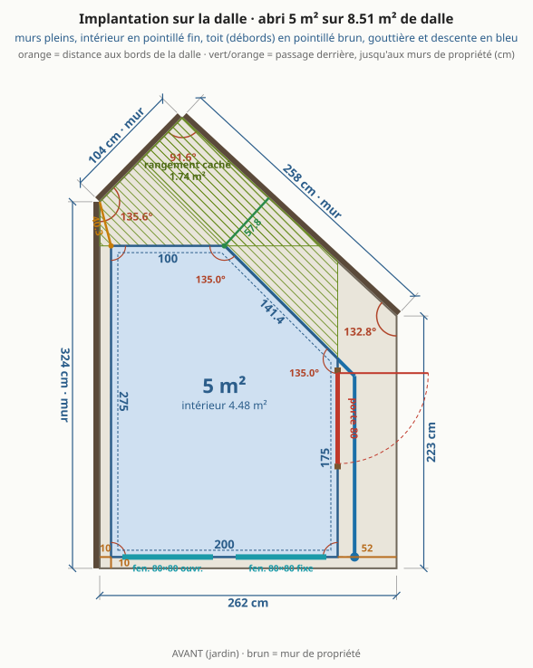
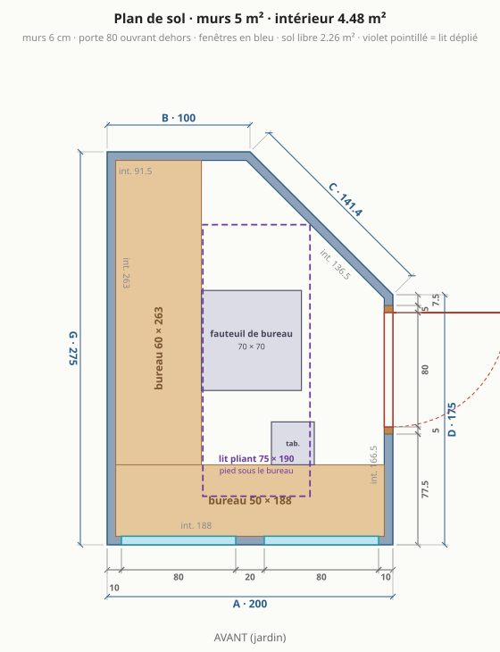
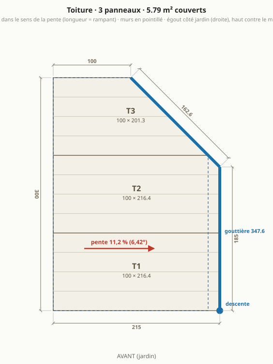
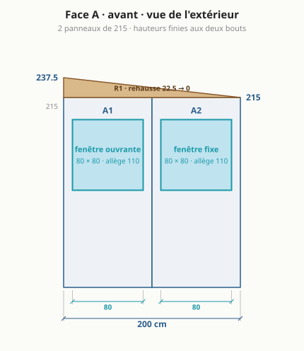
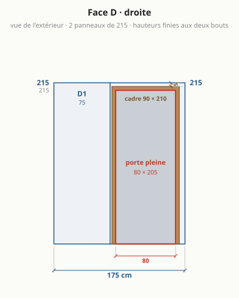
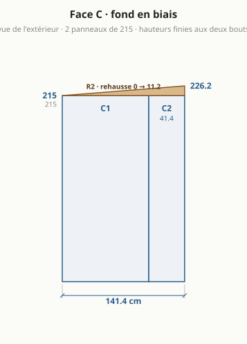
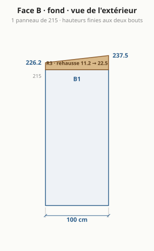
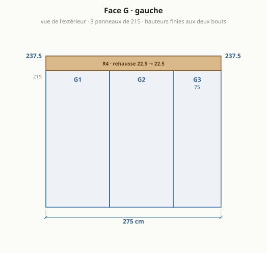
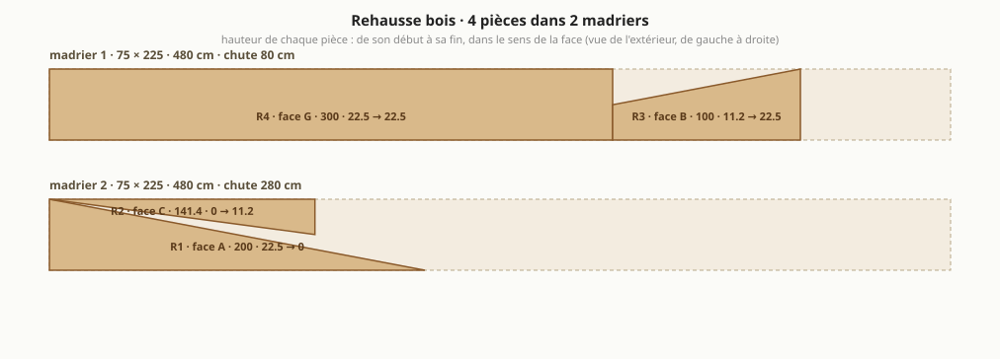

# Abri de jardin : le bureau à cinq murs, version 3 (fond d'équerre et pan à 45°)

> Généré par `npm run emit` depuis `params.json` (bloc `abri_v3`) et `site/src/compute.ts` : ne pas éditer à la main. Version de départ : [abri-v2.md](abri-v2.md). Autres formes étudiées : [variantes.md](variantes.md).

## Ce qui change par rapport à la version 2

| | version 2 ([abri-v2.md](abri-v2.md)) | **version 3** |
|---|---|---|
| murs (extérieur) | 5 m² | 5 m² |
| intérieur | **4,46 m²** | **4,48 m²** |
| emprise au sol (débords de toit exclus, R*420-1) | 5 m² | 5 m² |
| formalités (seuils 5 puis 20 m²) | aucune formalité | aucune formalité |
| murs | 4 : A 200 · D 200 · B 223,6 · G 300 cm | 5 : A 200 · D 175 · C 141,4 · B 100 · G 275 cm |
| angles | 90° · 90° · 116,6° · 63,4° | 90° · 90° · 135° · 135° · 90° |
| faces en panneaux entiers | A, D, G | A, B |
| bandes de mur de moins de 30 cm | 1 | 0 |
| panneaux de mur à commander | 10 | 10 |
| passage derrière l'abri | 51,5 cm | 57,8 cm |
| sens du toit | vers la droite (jardin) | vers la droite (jardin) |
| pente | 11,2 % (6,42°), chute 22,5 cm | 11,2 % (6,42°), chute 22,5 cm |
| portée du toit sans panne | 2 m | 2 m |
| panneaux de toit | 3, dont 2 coupé(s) en biais et 0 de moins de 30 cm de large | 3, dont 2 coupé(s) en biais et 0 de moins de 30 cm de large |
| gouttière et descente | 432,9 cm sur D + B, descente devant à droite, côté jardin | 322,6 cm sur D + C, descente devant à droite, côté jardin |
| rehausse | 3 pièces, 2 madrier(s) 75 × 225 | 4 pièces, 2 madrier(s) 75 × 225 |
| hauteurs finies des coins | 237,5 · 215 · 215 · 237,5 cm | 237,5 · 215 · 215 · 226,2 · 237,5 cm |
| espace caché derrière l'abri | 1,9 m², jusqu'à 115 cm de profondeur | 1,74 m², jusqu'à 113 cm de profondeur |
| porte | pleine, 80 × 205, débord de toit au-dessus : 15 cm | pleine, 80 × 205, débord de toit au-dessus : 15 cm |
| fenêtres en façade | 80 ouvrante + 80 fixe | 80 ouvrante + 80 fixe |
| sol libre hors bureaux | 2,21 m² | 2,26 m² |
| lit | 70 × 190, pliant, posé au sol libre | 70 × 190, pliant, posé au sol libre |
| budget indicatif HT | 3 001 € (coque 2 789 €) | 3 022 € (coque 2 810 €) |

### Ce que cette disposition apporte

- **La surface de la version 2, mieux dessinée** : 5 m² de murs et 4,48 m² d'intérieur (version 2 : 5 et 4,46 m²), donc **toujours sans formalité**. Mais le fond de la pièce est une travée d'équerre large d'un mètre, plus une pointe à 63° : 0,05 m² de sol libre en plus à surface égale.
- **Plus aucun angle aigu.** Les deux angles qui ne sont pas droits sont identiques, 135° : un seul profil d'angle plié à commander en deux exemplaires, et un bout de bureau gauche d'équerre contre le mur du fond.
- **La façade et le mur du fond restent en panneaux entiers** (200 et 100). Les murs gauche (275) et droit (175) ont chacun une bande de 75 cm, et le pan à 45° une bande de 41 cm. Les bandes sont placées là où on les atteint : celle du mur gauche est en bout côté façade, celle du mur droit côté façade aussi (le module entier du fond reçoit le cadre de la porte), celle du pan donne sur le passage.
- **Le pan à 45° longe le mur de propriété** (incliné à 42,8°) : le passage derrière garde une largeur presque constante au lieu de s'ouvrir en entonnoir, et il est **plus large que dans la version 2** : 57 cm au plus étroit contre 51 cm. La tondeuse manuelle y passe à l'aise.
- **10 cm de dalle visibles à gauche et devant** : l'abri ne vient pas au ras de la dalle. Devant, le rail de pied et sa bavette s'égouttent sur le béton et pas dans l'herbe ; à gauche, le vide contre le mur de propriété reste assez large pour être fermé proprement (bavette devant, grillage au fond) et pour que l'eau et les feuilles n'y restent pas.
- Tout ce que la version 2 apporte reste vrai ici : porte pleine sur le côté, à l'abri des regards de l'étage voisin ; lumière de côté sur les écrans du bureau gauche ; toit vers le jardin, portée de 2 m, madrier courant. Voir [abri-v2.md](abri-v2.md).

### Ce que la version 3 perd

- **Rangement caché derrière l'abri** : 1,74 m², contre 1,9 m² dans la version 2, passage compris. Le cinquième mur occupe le fond de la dalle, mais l'abri raccourci en rend une partie. La tondeuse manuelle, les outils à manche, le tuyau et quelques sacs y tiennent, contre le mur de propriété.
- **Un mur, un angle et une pièce de rehausse de plus**, et une gouttière en deux tronçons avec un angle (322.6 cm en tout) : l'eau du fond du toit sort par le pan à 45°, il faut donc la recueillir là aussi pour qu'elle ne tombe pas dans le passage.
- **Budget** : 21 € d'écart avec la version 2 (voir le tableau), pour les bandes de panneau et la pièce de rehausse en plus.
- Le lit de 190 rabattable contre un mur ne tient toujours pas : le fond fait 100 cm et le pan 141 cm. Lit pliant posé au sol, comme en version 2.

### Pourquoi

1. **La forme reste un vrai 45°** : mur gauche 275, mur droit 175, fond 100. Les deux murs ont été raccourcis de la même longueur, il reste donc toujours un coin de 100 × 100 à fermer, soit un pan à 45° de 141,4 cm, sans cote ajustée.
2. **Pourquoi 25 cm de moins et pas 20** : à 280 et 180 l'abri fait 5,10 m² de murs, juste au-dessus du seuil, et demande une déclaration préalable pour 0,10 m². À 275 et 175 il fait 5,00 m² : aucune formalité a priori. Pour revenir à 20, changer les deux nombres de `cotes_cm`. À exactement 5,00 m², une mairie pointilleuse peut discuter : 274 et 174 donnent 4,98 m².
3. **Pourquoi comparer à la version 2** : la version 3 en reprend tous les réglages (`herite`), seuls la forme et la bande gauche changent. Le tableau isole donc l'effet du cinquième mur.

### Conseils que les plans ne montrent pas

- Le mur gauche se monte à plat puis se lève (voir les conseils de la version 2) : on ne visse rien dans le vide de 10 cm. Le fermer devant par une bavette et au fond par un grillage.
- Le modèle dessine la gouttière sur les deux bords d'égout, mais pas sa pièce d'angle à 135° ni la pente à lui donner vers la descente : à prévoir à la commande.
- Le pan à 45° reçoit une pièce de rehausse en biais dont la hauteur varie le long du mur : c'est une coupe de plus dans le madrier, pas une difficulté.
- Même sans formalité, vérifier au PLU la règle d'implantation par rapport à la limite (à 10 cm de la limite, l'abri n'est ni en limite ni à 3 m).

## En bref

- **Dalle existante** : 8,51 m², côtés 262 / 223 / 258 / 104 / 324 cm, murs de propriété à gauche et au fond.
- **4,48 m² intérieur** (5 m² de murs), 57,8 cm de passage derrière.
- **5 murs** en panneaux sandwich 6 cm autoportants : façade 200, droite 175, fond en biais 141,4, fond 100, gauche 275 cm.
- **Toit** mono-pente vers la droite (jardin), 6,42° : 237,5 cm contre le mur gauche, 215 cm côté porte.
- **Porte pleine** 80 × 205 sur le mur droit, **2 fenêtres** en façade, **bureau en L** sur la façade et le mur gauche.
- **Matériaux** : 3 022 € TTC (2 569 € à 3 475 €), sans main-d'œuvre ni livraison ; équipement optionnel 216 €.

- **Formalités** : emprise au sol 5 m², surface de plancher 4,48 m² ⇒ aucune formalité.

## À trancher

- **Toit** : vers la droite (jardin), chute 22,5 cm (6,42°). Madrier 75 × 225 classe 4 : section courante, à vérifier en classe 4.
- **Formalités** : emprise au sol **5 m²** (les débords de toit, simples et en l'air, n'entrent pas dans l'emprise au sol : Code de l'urbanisme R*420-1), surface de plancher 4,48 m² ⇒ **aucune formalité** (seuils 5 puis 20 m²). secteur protégé ou abords d'un monument historique : déclaration préalable même sous le seuil ; le PLU (implantation, hauteur, distance aux limites) s'applique dans tous les cas.
- **Lit 70 × 190** : déplié au milieu, le pied sous un bureau, fauteuil et tabouret rangés.
- **Portée du toit** (~2 m au plus long) en 6 cm sans panne : à confirmer dans le tableau du fabricant.
- **Angles non droits** (135°, 135°) : profils d'angle pliés sur mesure.

## Plans

### Implantation sur la dalle

### Plan de sol

### Toiture

### Face A · façade (jardin)

### Face D · droite (porte)

### Face C · fond en biais

### Face B · fond

### Face G · gauche

### Rehausse bois : débit des madriers

## Dimensions

| face | longueur ext. | longueur int. | hauteur finie (début → fin) | angle au début |
|---|---|---|---|---|
| A · avant | 200 cm | 188 cm | 237,5 → 215 cm | 90° |
| D · droite | 175 cm | 166,5 cm | 215 → 215 cm | 90° |
| C · fond en biais | 141,4 cm | 136,5 cm | 215 → 226,2 cm | 135° |
| B · fond | 100 cm | 91,5 cm | 226,2 → 237,5 cm | 135° |
| G · gauche | 275 cm | 263 cm | 237,5 → 237,5 cm | 90° |

Murs 5 m² · intérieur 4,48 m² (murs de 6 cm retirés) · sol libre hors bureaux 2,26 m² · hauteur sous plafond 2,32 m devant, 2,09 m au plus bas (plancher isolé déduit).

## Débit

### Panneaux de mur (hauteur 215 cm, pose verticale)

| pièce | largeur | provenance | découpe |
|---|---|---|---|
| A1 | 100 cm | panneau entier | fenêtre 80 × 80 |
| A2 | 100 cm | panneau entier | fenêtre 80 × 80 |
| D1 | 75 cm | panneau recoupé | – |
| D2 | 100 cm | panneau entier | porte 90 × 210 |
| C1 | 100 cm | panneau entier | – |
| C2 | 41,4 cm | panneau recoupé | – |
| B1 | 100 cm | panneau entier | – |
| G1 | 100 cm | panneau entier | – |
| G2 | 100 cm | panneau entier | – |
| G3 | 75 cm | panneau recoupé | – |

**10 panneaux de mur** de 100 × 215 à commander (les bandes étroites sortent des chutes).

### Panneaux de toit (dans le sens de la pente, longueur = rampant)

| pièce | largeur | longueur à commander | coupe |
|---|---|---|---|
| T1 | 100 cm | 216,4 cm | entier, coupes droites |
| T2 | 100 cm | 216,4 cm | un bord en biais le long du mur du fond |
| T3 | 75 cm | 176,1 cm | refendu en largeur, un bord en biais le long du mur du fond |

Débords : 15 cm à droite (égout, au-dessus de la porte), 0 cm contre le mur de propriété, rives avant et fond affleurantes (bavette de rive). Surface couverte 5,25 m².

### Rehausse bois (madrier 75 × 225, stock 450 cm)

| pièce | face | longueur | hauteur début → fin |
|---|---|---|---|
| R1 | A | 200 cm | 22,5 → 0 cm |
| R2 | C | 141,4 cm | 0 → 11,2 cm |
| R3 | B | 100 cm | 11,2 → 22,5 cm |
| R4 | G | 275 cm | 22,5 → 22,5 cm |

**2 madriers** : n°1 = R4 puis R3 (chute 75 cm) ; n°2 = R1 + R2 (chute 250 cm). Deux pièces sur un même tronçon = une seule coupe en biais.

### Gouttière et profils

- Gouttière 322,6 cm en 2 tronçons (D 160 + C 162,6) : le long du pan en biais puis du mur droit, avec un angle, au-dessus de la porte ; descente au coin avant droit, côté jardin (récupérateur d'eau possible). Aucune eau dans le passage arrière ni au pied du mur de propriété.
- 5 angles : G/A 90°, A/D 90°, D/C 135°, C/B 135°, B/G 90° ; hauteur de chaque angle = hauteur finie du coin.
- Rail de pied sur tout le périmètre (8,91 m), bavettes de rive sur les côtés A et B.

## Ouvertures

| ouverture | taille | où | détail |
|---|---|---|---|
| porte pleine | 80 × 205 (cadre 90 × 210) | face D, de 82,5 à 162,5 cm depuis la façade | ouvre vers l'extérieur ; cadre à 5 cm du mur du fond (face intérieure) et sous le haut du mur |
| fenêtre oscillo-battante | 80 × 80 | face A, de 10 à 90 cm depuis le coin gauche | allège 110 cm, au-dessus du bureau, dans un seul panneau |
| fenêtre fixe | 80 × 80 | face A, de 110 à 190 cm depuis le coin gauche | allège 110 cm, au-dessus du bureau, dans un seul panneau |

## Aménagement

| élément | taille | place |
|---|---|---|
| bureau gauche | 60 × 263 cm | tout le mur gauche |
| bureau de façade | 50 × 188 cm | tout le mur de façade |
| fauteuil de bureau | 70 × 70 cm | devant le bureau gauche |
| tabouret | 30 × 30 cm | devant le bureau de façade |
| lit pliant (déplié) | 70 × 190 cm | au milieu, pied sous un bureau, sièges rangés |

## Matériaux à acheter (prix TTC, sans main-d'œuvre, sans livraison)

### Panneaux · 1 220 €

| matériau | quantité | prix unitaire | montant | comment c'est compté, d'où vient le prix |
|---|---|---|---|---|
| Panneaux sandwich de mur 60 mm, 100 × 215 cm *(prix à confirmer)* | 21,5 m² | 44 € | 946 € | 10 panneaux entiers à commander (les bandes recoupées sortent des chutes). fixation cachee PIR 60 mm : 37,80 EUR/m2 par paquet entier ; 40 a 50 EUR/m2 en petite quantite ou au detail (negoce). La plupart des vendeurs en ligne imposent 100 m2 ou un paquet de 12 panneaux de 6 m. ([source](https://www.panelsell.fr/articles-en-stock-panneaux-de-toiture-bardage/panneaux-sandwichs-bardage-fixation-cachee-60-mm-lw-70)) |
| Panneaux sandwich de toiture 60 mm, nervurés, teinte claire *(prix à confirmer)* | 6,09 m² | 45 € | 274 € | 3 panneaux coupés à longueur : T1 216,4 cm, T2 216,4 cm, T3 176,1 cm. 35,40 EUR/m2 par paquet de 10 ; 34,20 chez toleacier.fr en longueurs de stock ; jusqu'a 71 EUR/m2 au detail en negoce (Ondatherm). Teinte claire RAL 9010 disponible sur commande. ([source](https://www.panelsell.fr/articles-en-stock-panneaux-de-toiture-bardage/panneaux-sandwich-toiture-60-mm-lw-128)) |

### Bois · 157 €

| matériau | quantité | prix unitaire | montant | comment c'est compté, d'où vient le prix |
|---|---|---|---|---|
| Madrier 75 × 225 classe 4 (rehausse, lisse haute) | 9 ml | 15 € | 132 € | 2 pièce(s) de 450 cm. classe 4 : la section en stock est 70 x 220 (58,80 EUR les 4 m, 66 EUR les 4,5 m). Le 75 x 225 n'existe en stock qu'en classe 2 (environ 10 EUR/m). ([source](https://www.boidiscount.com/index.php?p=1_190_PRIX-BASTAINGS-MADRIERS-BOIS-D-OSSATURE.-TRAIT-AUTOCLAVE-CLASSE-4)) |
| Bois du cadre de porte, section 50 × 60 mm *(prix à confirmer)* | 5 ml | 5 € | 25 € | deux montants + une traverse haute. pas de prix releve |

### Profils et bavettes · 470 €

| matériau | quantité | prix unitaire | montant | comment c'est compté, d'où vient le prix |
|---|---|---|---|---|
| Profil de départ en U (rail de pied) *(prix à confirmer)* | 8,01 ml | 12 € | 96 € | périmètre des murs moins le cadre de la porte. 4,86 EUR HT la longueur de 0,5 m ([source](https://www.panelsell.fr/accessoires-pour-panneaux-sandwichs)) |
| Profils d'angle à 90°, extérieur + intérieur | 13,8 ml | 10 € | 138 € | 3 angles droits, hauteur finie de chaque coin, deux faces. 7,92 EUR HT le metre, tole 0,75 mm ([source](https://www.panelsell.fr/profiles-plies-pour-panneaux-sandwichs-sur-mesure/profile-d-angle-exterieur)) |
| Profils d'angle pliés sur mesure (135°), extérieur + intérieur *(prix à confirmer)* | 8,82 ml | 15 € | 132 € | 2 angles non droits, deux faces. aucun prix public pour un pliage a 135 degres : estimation d'apres le profil standard, a faire chiffrer ([source](https://www.panelsell.fr/profiles-plies-pour-panneaux-sandwichs-sur-mesure/profile-d-angle-exterieur)) |
| Bandes de rive de toit | 3,15 ml | 14 € | 44 € | bords du toit parallèles à la pente. 12,90 EUR/m en longueurs de 2,1 m ([source](https://www.yousteel.fr/pliages-accessoires/180-bande-de-rive-universelle-2100m.html)) |
| Bavette de tête (bord haut du toit) | 2,75 ml | 14 € | 39 € | bord haut du toit. solin ou faitiere 2,10 m : 29 EUR ([source](https://www.mastock.fr/toiture/846-1506-accessoires-tole-bac-acier.html)) |
| Closoirs mousse sous les nervures *(prix à confirmer)* | 5,98 ml | 4 € | 21 € | bord haut + bord d'égout. rouleau de 6 m de 11,90 a 21,90 EUR ; le profil doit correspondre aux nervures du panneau choisi ([source](https://www.leroymerlin.fr/produits/closoir-mousse-pour-plaque-acier-6-m-66887583.html)) |

### Fixations · 117 €

| matériau | quantité | prix unitaire | montant | comment c'est compté, d'où vient le prix |
|---|---|---|---|---|
| Vis autoperceuses de toiture à rondelle, longues (panneau + nervure dans le bois) | 0,27 cent | 90 € | 24 € | 3 panneaux × 2 appuis × 4 vis, +10 %. inox 6,5 x 145 a rondelle EPDM : 89,99 EUR le cent. Longueur = panneau + nervure + 50 mm dans le bois. ([source](https://www.wovar.fr/vis-pour-panneaux-sandwich-inox/)) |
| Vis de couture (recouvrements de panneaux, bavettes, profils) | 0,66 cent | 35 € | 23 € | un recouvrement tous les 40 cm, une bavette tous les 30 cm, +10 %. 4,8 x 20 : de 24 a 45 EUR le cent ([source](https://www.toletome.fr/les-produits-tole-to-me/accessoires-de-fixation/visserie/vis-de-couture-en-acier-(4-8-x-20).html)) |
| Vis autoperceuses de panneaux de mur (pied et tête) | 0,66 cent | 90 € | 59 € | 10 panneaux × 2 extrémités × 3 vis, +10 %. vis 6,3 x 100 + rondelle + cache de couleur ([source](https://www.tolesmoinscheres.com/produit/100-fixations-pour-panneau-sandwich-de-bardage)) |
| Chevilles ou goujons pour fixer le rail dans la dalle | 20 u | 1 € | 11 € | une tous les 50 cm. goujons 8 x 80 : 55,90 EUR la boite de 100 ([source](https://www.toutbrico.com/goujons-d-ancrage/7242-boite-100-goujons-d-ancrage-8-x-80mm-zingue-batifix-3700013413404.html)) |

### Étanchéité · 173 €

| matériau | quantité | prix unitaire | montant | comment c'est compté, d'où vient le prix |
|---|---|---|---|---|
| Bande d'arase sous le rail de pied | 8,91 ml | 1 € | 5 € | périmètre des murs. rouleau de 30 m x 30 cm : 16,90 EUR ([source](https://www.bricodepot.fr/catalogue/bande-darase-long-30-m-larg-30-cm-500-microns/prod59812/)) |
| Bande butyle (joints de panneaux, tête de mur sous la rehausse) | 23,66 ml | 2 € | 35 € | 5 joints de mur × 2,2 m + périmètre + recouvrements de toit. rouleau de 13 m : 19,66 EUR ([source](https://tolganor.fr/produit/joint-butyl-pour-etancheite-rouleau-de-13-ml-etanco/)) |
| Mastic polyuréthane ou MS polymère, cartouches | 4 cartouche | 9 € | 36 € | une cartouche pour 8 m de cordon : pied de mur dedans et dehors, tour des ouvertures. MS polymere de 6,50 a 13 EUR ; Sikaflex 11FC environ 11,50 EUR ([source](https://www.maxoutil.com/mastic-ms-polymere-parabond-600-dl-chemicals-cartouche-de-290-ml-40001000.html)) |
| Bande comprimée au pourtour des ouvertures *(prix à confirmer)* | 11,3 ml | 7 € | 79 € | tour de la porte et des fenêtres. rouleau de 5 m : 44 EUR en negoce, moins cher ailleurs ([source](https://www.pointp.fr/p/couverture/bande-mousse-impregnee-bitume-20x30-rouleau-de-5m-A3242825)) |
| Mousse polyuréthane expansive, bombes | 2 bombe | 9 € | 18 € | calfeutrement des ouvertures et des angles. 750 ml : de 7,90 a 9,90 EUR ([source](https://www.bricodepot.fr/produits/materiau-et-gros-oeuvre/isolation-et-cloison/etancheite/mousse-expansive)) |

### Ouvertures · 519 €

| matériau | quantité | prix unitaire | montant | comment c'est compté, d'où vient le prix |
|---|---|---|---|---|
| Porte de service pleine isolée 80 × 205 cm, avec dormant | 1 u | 199 € | 199 € | une porte. bloc-porte de service PVC plein 205 x 80 avec dormant, serrure 5 points, Ud 1,6. Les tailles standard sont 205 ou 215 x 80 ou 90 ; 100 de large n'existe pas en standard. ([source](https://www.bricodepot.fr/catalogue/bloc-porte-de-service-en-pvc-poussant-droit-h-205-x-l-80-cm/prod54514/)) |
| Fenêtre fixe PVC double vitrage 80 × 80 cm *(prix à confirmer)* | 1 u | 165 € | 165 € | fenêtres fixes. 80 x 80 n'est pas une taille de stock : chassis fixe sur mesure, 4 a 5 semaines ([source](https://www.brico-fenetre.com/fr_FR/p/chassis-fixe-simple-pvc-gamme-confort)) |
| Fenêtre oscillo-battante PVC double vitrage 80 × 80 cm | 1 u | 155 € | 155 € | fenêtres ouvrantes. 80 x 80 sur mesure a partir de 155 EUR, port en plus. En stock : 80 de large x 75 de haut (2 vantaux) 119 EUR, x 105 de haut 129 EUR (Brico Depot). ([source](https://www.fenetre24.com/fenetre-pvc-80x80-cm.php)) |

### Eaux pluviales · 87 €

| matériau | quantité | prix unitaire | montant | comment c'est compté, d'où vient le prix |
|---|---|---|---|---|
| Gouttière demi-ronde | 3,23 ml | 5 € | 15 € | 2 tronçon(s) : D 160 cm + C 162,6 cm. PVC demi-ronde de 25 : 9,40 EUR les 2 m (zinc : 22,50 EUR les 2 m) ([source](https://www.bricodepot.fr/produits/materiau-et-gros-oeuvre/gros-oeuvre-et-evacuation-des-eaux/evacuation-des-eaux-de-pluie/gouttiere-pvc)) |
| Crochets de gouttière | 8 u | 2 € | 16 € | un tous les 50 cm ([source](https://www.brico-toiture.com/175-gouttiere-pvc-25-80-gris)) |
| Naissance, fonds, angle, coudes et colliers (lot) | 1 lot | 45 € | 45 € | un angle, une naissance, deux fonds, deux coudes, deux colliers. naissance 14 + 2 fonds 6 + jonction ou angle 5 + 2 coudes 11 + 3 colliers 8 ([source](https://www.brico-toiture.com/175-gouttiere-pvc-25-80-gris)) |
| Tuyau de descente | 2,15 ml | 5 € | 11 € | hauteur du mur côté égout. tube de 80 : 10 EUR les 2 m ([source](https://www.brico-toiture.com/175-gouttiere-pvc-25-80-gris)) |

### Plancher isolé · 212 €

| matériau | quantité | prix unitaire | montant | comment c'est compté, d'où vient le prix |
|---|---|---|---|---|
| Lambourdes traitées (entraxe 40 cm) | 13 ml | 3 € | 43 € | surface intérieure ÷ 0,40 m, +10 %. classe 4, 45 x 70, 2,70 m : 8,90 EUR ([source](https://www.bricodepot.fr/catalogue/lambourde-en-bois-classe-4-2700-x-70-x-45-mm/prod97284/)) |
| Isolant rigide 40 mm entre lambourdes | 4,7 m² | 7 € | 35 € | surface intérieure, +5 %. polystyrene extrude 40 mm ([source](https://www.leroymerlin.fr/produits/materiaux/isolation/plaque-polystyrene/polystyrene-extrude/polystyrene-extrude-40-mm-prix-p.html)) |
| Film polyéthylène sous le plancher | 5,15 m² | 1 € | 5 € | surface intérieure, +15 % de recouvrements. rouleau de 20 m2 : 19,90 EUR ([source](https://www.bricodepot.fr/catalogue/rouleau-pare-vapeur-ep-015-mm-20-m-l-200cm-x-l-1000cm/prod90796/)) |
| Dalles OSB3 18 mm rainurées | 4,93 m² | 11 € | 55 € | surface intérieure, +10 % de chutes. dalle OSB3 18 mm 2500 x 675 : 18,95 EUR ([source](https://www.lamaison.fr/0275785.html)) |
| Revêtement de sol (vinyle ou stratifié) | 4,93 m² | 15 € | 74 € | surface intérieure, +10 % de chutes. vinyle rigide a clipser ; stratifie des 5 EUR/m2 ([source](https://www.bricodepot.fr/produits/carrelage-stratifie-et-parquet/stratifie-parquet-et-sol-vinyle-pvc)) |

### Équipement (optionnel) · 216 €

| matériau | quantité | prix unitaire | montant | comment c'est compté, d'où vient le prix |
|---|---|---|---|---|
| Grilles ou entrées d'air murales | 2 u | 8 € | 16 € | une basse, une haute, sur deux murs opposés. grille avec moustiquaire, de 4 a 16 EUR ; un extracteur hygroreglable coute 95 EUR ([source](https://www.bricodepot.fr/produits/chauffage-clim-et-ventilation/climatisation-et-confort-thermique/vmc-et-extracteur-d-air/grille-d-aeration)) |
| Goulotte électrique 2 m | 3 u | 15 € | 45 € | la moitié du périmètre, en longueurs de 2 m. 60 x 40, longueur de 2 m ([source](https://www.bricodepot.fr/produits/electricite/installation-electrique/goulotte-plinthe-et-moulure-electrique/goulotte-electrique)) |
| Multiprise parafoudre *(prix à confirmer)* | 1 u | 20 € | 20 € | sur le câble déjà en place. pas de prix lu, 15 a 30 EUR |
| Réglette ou plafonnier LED | 1 u | 10 € | 10 € | un point lumineux. reglette LED 120 cm 36 W : 6,90 EUR ([source](https://www.bricodepot.fr/p/3501709011368/reglette-led-etanche-36w-120-cm-blanc-neutre-4000k-2400-lm-ip65)) |
| Radiateur panneau 750 W à thermostat | 1 u | 65 € | 65 € | bureau chauffé toute l'année. panneau acier 750 W, thermostat, detection de fenetre ouverte ([source](https://www.bricodepot.fr/catalogue/radiateur-acier-jaina-blanc-750-w/prod87074/)) |
| Stores des fenêtres de façade *(prix à confirmer)* | 2 u | 30 € | 60 € | un par fenêtre. pas de prix releve |

### Consommables · 67 €

| matériau | quantité | prix unitaire | montant | comment c'est compté, d'où vient le prix |
|---|---|---|---|---|
| Lame de scie circulaire pour métal (coupe à froid des panneaux) | 1 u | 67 € | 67 € | jamais de meuleuse : elle brûle le laquage et la mousse. Bosch Expert for Sandwich Panel, 36 dents ([source](https://clickoutil.com/lame-scie-circulaire/142169-lames-de-scies-circulaires-expert-for-sandwich-panel-bosch.html)) |

**Total des matériaux : 3 022 € TTC** (fourchette 2 569 € à 3 475 €, ±15 %). Équipement optionnel en plus : 216 €. Hors total : Livraison des panneaux (service, hors total) ≈ 250 €.

Prix relevés chez des marchands français (`prix_materiaux_eur_ttc` dans `params.json`, source notée pour chacun) ; les quantités se recalculent avec l'abri.

## Guide de montage

### Avant de commander

- Faire confirmer par le fournisseur la **largeur utile** des panneaux (100 cm ici, la largeur de tous les panneaux de 60 mm relevés) : tout le calepinage en dépend.
- **Acheter des panneaux en petite quantité est le vrai sujet.** Les vendeurs en ligne les moins chers imposent 100 m² ou un paquet entier de panneaux de 6 à 7,5 m. Demander un devis « coupé à longueur, petite quantité » à deux spécialistes et à un négoce local, qui vend au panneau mais plus cher. Sinon acheter des longueurs de stock et les recouper sur place : compter alors plus de surface que le débit.
- Rehausse : le madrier 75 × 225 ne se trouve en stock qu'en **classe 2**. En **classe 4** la section courante est 70 × 220, en 4 m ou 4,5 m : la prendre (la chute du toit perd 5 mm, sans conséquence) ou protéger un classe 2 par la bavette.
- Fenêtres : 80 × 80 n'est pas une taille de stock (sur mesure, 4 à 5 semaines). En stock il existe du 80 de large × 75 ou 105 de haut. Porte : le bloc de service plein 205 × 80 avec dormant est un article de stock.
- Faire confirmer la **portée** admise du panneau de toit de 6 cm : 2 m ici ; et la **pente minimale** (11,2 % ici ; ArcelorMittal admet 5 % pour des panneaux d'une seule longueur, sans pénétration ni recouvrement en bout).
- Commander les panneaux de toit **coupés à longueur**, et les profils des angles de 135° **pliés sur mesure**, en même temps que les panneaux.
- Vérifier au PLU la règle d'implantation (l'abri est à 10 cm de la limite).
- Prévoir deux personnes pour lever les murs et poser le toit, et une journée sans vent : un panneau de 2 m² est une voile.

### Outillage

- Scie circulaire avec **lame pour métal** (coupe à froid) et rail de guidage ; scie sauteuse lame métal pour les angles des ouvertures. **Pas de meuleuse** : elle brûle le laquage et la mousse, et ses étincelles piquent la tôle.
- Visseuse à choc avec douilles 8 mm, perforateur et foret béton, cordeau à tracer, mètre de 5 m, niveau de 1,20 m ou laser, grande équerre, fil à plomb.
- Pistolet à mastic, cutter, serre-joints, 4 étais ou chevrons pour tenir les murs pendant le montage, échelle ou escabeau stable.
- Gants anti-coupure, lunettes, protection auditive. Les rives de tôle coupent.

### Étape 1 · Tracer l'abri sur la dalle

Tout le reste s'aligne sur ce tracé : dix minutes de plus ici évitent un mur qui ne ferme pas.

**Outils :** cordeau, mètre, grande équerre

1. Tracer la façade à 10 cm du bord avant de la dalle et le mur gauche à 10 cm du bord gauche.
2. Reporter les 5 murs dans l'ordre : A 200 cm, D 175 cm, C 141,4 cm, B 100 cm, G 275 cm.
3. Angles, dans le même ordre : 90°, 90°, 135°, 135°, 90°.

**À contrôler avant de continuer :**

- [ ] Diagonales du tracé : coin avant gauche → haut du mur droit = 265,8 cm ; coin avant droit → coin arrière gauche = 340 cm.
- [ ] Passage derrière l'abri : 57,8 cm au plus étroit, à mesurer une fois le tracé fait.

### Étape 2 · Poser le rail de pied

Le rail tient le pied des panneaux et les isole de l'eau de la dalle.

**Outils :** perforateur, visseuse, niveau

1. Dérouler la bande d'arase sur le tracé (8,91 m), poser le profil en U dessus, **nu extérieur du rail sur le trait**.
2. Cheviller tous les 50 cm, et à 10 cm de chaque angle.
3. Interrompre le rail sur la largeur du cadre de la porte (90 cm, face D).
4. Cordon de mastic continu entre le rail et la dalle, côté extérieur.

**À contrôler avant de continuer :**

- [ ] Rail de niveau : caler si la dalle a plus de 5 mm de faux niveau sur un mur.
- [ ] Angles du rail conformes au tracé avant de cheviller le dernier mur.

### Étape 3 · Préparer toutes les coupes à plat

Un panneau se coupe bien sur tréteaux, mal une fois debout.

**Outils :** scie circulaire lame métal, rail de guidage, scie sauteuse

1. Bandes de mur : D1 75 cm, C2 41,4 cm, G3 75 cm. Couper dans la longueur, face laquée vers le bas, et garder les chutes : elles fournissent les autres bandes.
2. Fenêtres : 80 × 80 cm, bas à 110 cm ; 80 × 80 cm, bas à 110 cm, une par panneau, jamais sur un joint. Percer les quatre angles, puis couper à la scie sauteuse.
3. Toit : T2, T3 à couper en biais d'après le plan de toiture.
4. Rehausse : R1 (mur A, 200 cm, 22,5 → 0 cm), R2 (mur C, 141,4 cm, 0 → 11,2 cm), R3 (mur B, 100 cm, 11,2 → 22,5 cm), R4 (mur G, 275 cm, 22,5 → 22,5 cm), tirées de 2 madrier(s) selon le plan de débit.

**À contrôler avant de continuer :**

- [ ] Retirer le film de protection des panneaux au fur et à mesure : après quelques semaines au soleil il ne part plus.
- [ ] Ébavurer chaque coupe et passer une retouche de peinture sur la tôle mise à nu.

### Étape 4 · Monter le mur gauche à plat, puis le lever

À 10 cm du grillage de la limite aucune visseuse ne passe : ce mur se fait au sol.

**Outils :** visseuse, serre-joints, 2 personnes, étais

1. Assembler G1 (100), G2 (100), G3 (75) à plat, butyle dans chaque joint, et visser dessus leur pièce de rehausse.
2. Placer la bande de 75 cm côté façade, la seule extrémité qu'on atteindra ensuite.
3. Lever le mur à deux, l'engager dans le rail, le tenir par deux étais vissés dans la rehausse.
4. Visser le pied dans le rail depuis l'intérieur.

**À contrôler avant de continuer :**

- [ ] Aplomb dans les deux sens avant de lâcher les étais.
- [ ] Vide de 10 cm régulier sur toute la longueur.

### Étape 5 · Monter les autres murs

On tourne dans un seul sens pour que chaque panneau s'emboîte dans le précédent.

**Outils :** visseuse, niveau, étais

1. Mur B (fond, 100 cm) : B1 (100).
2. Mur C (fond en biais, 141,4 cm) : C1 (100), C2 (41,4).
3. Mur D (droite, 175 cm) : D1 (75), D2 (100), en laissant le vide du cadre de porte.
4. Mur A (façade, 200 cm) : A1 (100), A2 (100).
5. Butyle dans chaque emboîtement, panneau serré contre le précédent, vissé au pied dans le rail.
6. Étayer chaque mur tant que la rehausse n'est pas posée : avant elle, rien ne tient les têtes.

**À contrôler avant de continuer :**

- [ ] Aplomb de chaque panneau avant de visser le suivant : l'erreur se cumule.
- [ ] Têtes de murs toutes à 215 cm, à 3 mm près, au niveau laser.

### Étape 6 · Fermer les angles

Les profils d'angle lient deux murs et ferment la mousse.

**Outils :** visseuse, mastic

1. Profil extérieur puis intérieur à chacun des 5 angles, vissé tous les 30 cm (vis de couture), mastic sous les deux ailes.
2. Les angles de 135° reçoivent les profils pliés sur mesure : les présenter à blanc avant de percer.
3. Bourrer le vide de l'angle à la mousse avant de fermer le profil intérieur.

**À contrôler avant de continuer :**

- [ ] Aucun jour entre profil et panneau : c'est là que l'air et l'eau entrent.

### Étape 7 · Poser la rehausse bois

Elle donne la pente au toit et sert de lisse haute : c'est elle qui tient les murs entre eux.

**Outils :** visseuse, serre-joints

1. Poser R1 sur A, R2 sur C, R3 sur B, R4 sur G, sur un cordon de butyle en tête de panneaux.
2. Visser la rehausse dans la tôle des deux faces de chaque panneau, tous les 40 cm.
3. Assembler les pièces entre elles aux angles par deux longues vis en biais.

**À contrôler avant de continuer :**

- [ ] Hauteurs finies des coins : 237,5 · 215 · 215 · 226,2 · 237,5 cm (dans l'ordre des coins, à partir du coin avant gauche).
- [ ] Dessus de la rehausse dans un même plan : poser une règle d'un mur à l'autre.

### Étape 8 · Couvrir

Nervures dans le sens de la pente, vers la droite (jardin) : l'eau ne quitte le toit que par le bas des panneaux.

**Outils :** visseuse, 2 personnes, échelle

1. Poser T1 (100 × 216,4 cm), T2 (100 × 216,4 cm), T3 (75 × 176,1 cm), en commençant du côté opposé aux vents dominants.
2. Closoirs mousse sous les nervures, en haut et en bas, avant de visser.
3. Visser dans la rehausse par le sommet des nervures, vis longues à rondelle, quatre par panneau et par appui. Serrer jusqu'à écraser la rondelle, pas plus.
4. Recouvrements entre panneaux : butyle, puis vis de couture tous les 40 cm.
5. Bandes de rive sur les bords parallèles à la pente, bavette de tête sur le bord haut.

**À contrôler avant de continuer :**

- [ ] Débords : 0 cm devant, 0 cm au fond, 15 cm à droite, 0 cm à gauche.
- [ ] Ne jamais marcher entre deux appuis : marcher au droit des murs, sur une planche.

### Étape 9 · Gouttière et descente

Recueillir toute l'eau du toit et l'emmener au jardin.

**Outils :** visseuse, niveau, scie à métaux

1. 322,6 cm de gouttière en 2 tronçon(s) : D 160 cm + C 162,6 cm.
2. Crochets tous les 50 cm, pente de 5 mm par mètre vers la descente.
3. Descente au point bas, évacuée loin de la dalle.

**À contrôler avant de continuer :**

- [ ] Verser un seau d'eau en haut du toit : tout doit arriver à la descente.

### Étape 10 · Poser la porte

Le cadre bois reprend la porte : le panneau seul ne porte pas de paumelles.

**Outils :** visseuse, niveau, cales

1. Monter le cadre bois de 90 × 210 cm dans le vide du mur D, vissé dans la dalle en pied et dans la rehausse en tête.
2. Poser la porte pleine de 80 × 205 cm dans le cadre, ferrée côté fond, ouvrant vers l'extérieur.
3. Bande comprimée entre dormant et cadre, mastic à l'extérieur, seuil sur cordon de mastic.

**À contrôler avant de continuer :**

- [ ] Jeu régulier de 3 mm autour du battant, la porte se ferme sans forcer.
- [ ] Arrêt de porte à prévoir : ouverte, elle prend le vent.

### Étape 11 · Poser les fenêtres

Une fenêtre se fixe dans la tôle des deux faces, jamais dans la mousse.

**Outils :** visseuse, niveau, cales

1. 2 fenêtre(s) en façade : oscillo-battante de 10 à 90 cm ; fixe de 110 à 190 cm.
2. Habiller la tranche de la découpe d'un profil en U ou d'un tasseau, caler la fenêtre, visser par le dormant.
3. Bande comprimée au pourtour, mastic dehors, bavette d'appui sous la fenêtre.

**À contrôler avant de continuer :**

- [ ] Niveau et aplomb du dormant avant le serrage final.
- [ ] L'ouvrante s'ouvre sans toucher le bureau.

### Étape 12 · Étanchéité générale

L'air qui entre apporte l'humidité qui condense sur l'acier.

**Outils :** pistolet à mastic, mousse

1. Cordon de mastic au pied des murs, dedans et dehors.
2. Fermer le vide de 10 cm contre le grillage de la limite : bavette devant, grillage fin au fond (feuilles, rongeurs), sans bloquer l'écoulement de l'eau.
3. Mousse puis mastic à chaque traversée (câble, entrée d'air).

**À contrôler avant de continuer :**

- [ ] De nuit, une lampe allumée dedans : aucun jour visible de dehors.

### Étape 13 · Plancher isolé

La dalle est froide : le plancher fait le confort des pieds.

**Outils :** scie, visseuse

1. Film polyéthylène sur la dalle, remonté de 10 cm le long des murs.
2. Lambourdes tous les 40 cm, calées de niveau, isolant rigide de 40 mm entre elles.
3. Dalles OSB de 18 mm vissées, joints décalés, 8 mm de jeu contre les murs ; revêtement de sol ensuite.

**À contrôler avant de continuer :**

- [ ] Hauteur sous plafond après plancher : 2,32 m au plus haut, 2,09 m au plus bas.

### Étape 14 · Ventilation, électricité, aménagement

Une pièce étanche et chauffée sans ventilation condense.

**Outils :** scie cloche, visseuse

1. Deux entrées d'air sur deux murs opposés, une basse et une haute.
2. Électricité en apparent, sous goulotte, depuis le câble existant : on ne perce pas la tôle extérieure pour un câble.
3. Bureaux sur pieds ou sur équerres au sol : 60 × 263 cm à gauche, 50 × 188 cm en façade. Les parements de 0,5 mm ne portent pas une charge suspendue.

**À contrôler avant de continuer :**

- [ ] Après une semaine chauffée : aucune trace de condensation aux angles ni autour des fenêtres.

