# Formes d'abri possibles sur la dalle

> Généré par `npm run emit` depuis `params.json` et `site/src/compute.ts` : ne pas éditer à la main.

## Hypothèses

- **Dalle réelle** : 8,51 m², côtés avant 262, droite 223, grand pan du fond 258, petit pan du fond 104, gauche 324 cm.
- **Bandes libres** laissées le long de chaque côté : avant 5, droite 5, grand pan du fond 45, petit pan du fond 12, gauche 12 cm. Reste la **zone utile** : 6,59 m².
- **Porte** de 100 cm sur le côté avant (jardin), ouvrant vers l'extérieur : elle ne prend aucune place dedans.
- **Intérieur** = murs en panneaux sandwich de 6 cm retirés sur tout le tour. Les couvre-joints d'angle intérieurs (quelques mm) sont négligés.
- **Hauteur sous plafond** (toutes les options) : 2,32 m à l'avant, 2,09 m au fond = murs 215 + rehausse 22,5 à l'avant, moins le plancher isolé de 6 cm.
- **Seuil** : jusqu'à 5 m² de murs, aucune formalité (à confirmer en mairie, et le PLU s'applique quand même).
- **Passage** : écart réel entre l'abri et chaque mur de propriété du fond (vert ≥ 50, orange 35 à 50, rouge < 35).

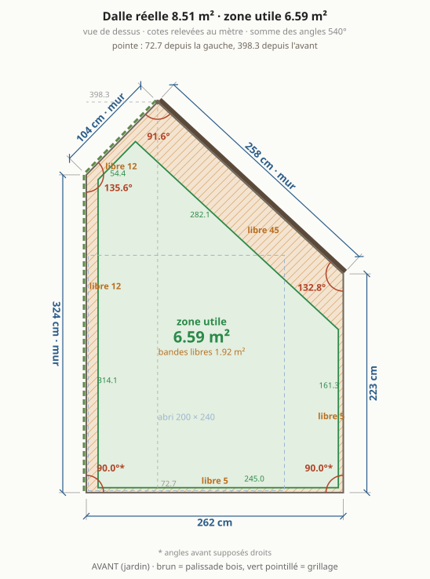

## En bref

- **Le plus simple** : option 1, panneaux entiers, angles droits.
- **Le meilleur compromis sous le seuil** : option 12, l'option 1 élargie à toute la façade avec un seul coin coupé.
- **Sous le seuil avec 4 murs** : option 11, pleine largeur et le passage le plus large des trapèzes.
- **Bureau en L, passage visé derrière** : option 13, porte à droite, bureau sur tout le mur gauche et toute la façade.
- **Le plus grand intérieur facile à meubler** : option 5, que des angles obtus, mais au-dessus du seuil.

## Comparatif

| # | forme | murs (ext.) | **intérieur** | côtés | passage grand pan | passage petit pan | ≤ 5 m² |
|---|---|---|---|---|---|---|---|
| [1](#option-1) | rectangle en panneaux entiers | 4 m² | **3,53 m²** | 4 | 47,2 cm | 119,6 cm | oui |
| [2](#option-2) | plus grand rectangle | 4,07 m² | **3,6 m²** | 4 | 45 cm | 129,6 cm | oui |
| [3](#option-3) | rectangle pleine largeur | 3,94 m² | **3,47 m²** | 4 | 57,2 cm | 158,5 cm | oui |
| [4](#option-4) | coin coupé, plafonné à 5 m² | 5 m² | **4,49 m²** | 5 | 45 cm | 110,5 cm | oui |
| [5](#option-5) | coin coupé, pleine profondeur | 6,44 m² | **5,83 m²** | 5 | 44,9 cm | 12 cm | non |
| [6](#option-6) | toute la zone utile | 6,59 m² | **5,97 m²** | 5 | 44,9 cm | 12 cm | non |
| [7](#option-7) | plus grand rectangle, orientation libre | 4,07 m² | **3,6 m²** | 4 | 45 cm | 125,4 cm | oui |
| [8](#option-8) | plus grand quadrilatère | 5,99 m² | **5,38 m²** | 4 | 44,9 cm | 12 cm | non |
| [9](#option-9) | trapèze, mur arrière en biais | 5,82 m² | **5,23 m²** | 4 | 50,8 cm | 12 cm | non |
| [10](#option-10) | trapèze plafonné à 5 m² | 5 m² | **4,45 m²** | 4 | 55,4 cm | 12 cm | oui |
| [11](#option-11) | trapèze pivoté, plafonné à 5 m² | 5 m² | **4,43 m²** | 4 | 95,6 cm | 12 cm | oui |
| [12](#option-12) | coin coupé au module | 4,81 m² | **4,3 m²** | 5 | 47,2 cm | 119,6 cm | oui |
| [13](#option-13) | trapèze, 50 cm derrière, ~4.8 m² intérieur | 5,37 m² | **4,81 m²** | 4 | 50,6 cm | 12 cm | non |

## Option 1

**rectangle en panneaux entiers** · 2 × 2 modules de 100 : aucune recoupe, angles droits

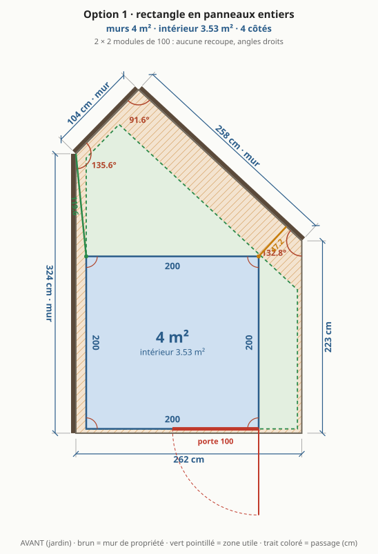

| | murs (extérieur) | intérieur |
|---|---|---|
| surface | 4 m² | **3,53 m²** |
| côté avant | 200 cm | 188 cm |
| côté droite | 200 cm | 188 cm |
| côté fond | 200 cm | 188 cm |
| côté gauche | 200 cm | 188 cm |
| angles | 90° · 90° · 90° · 90° | |
| passage arrière | grand pan 47,2 cm · petit pan 119,6 cm | |
| porte | 100 cm sur le côté avant, de 100 à 200 cm | |

- ✅ panneaux entiers sur les 4 faces : aucune recoupe
- ✅ le plus simple et le moins cher à monter
- ✅ sous le seuil même si la mairie compte les débords
- ⚠️ le plus petit bureau de la liste
- ⚠️ laisse inutilisée toute la bande de dalle à droite

## Option 2

**plus grand rectangle** · le plus grand rectangle qui tient dans la zone

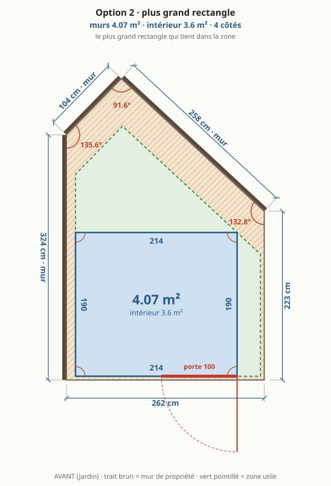

| | murs (extérieur) | intérieur |
|---|---|---|
| surface | 4,07 m² | **3,6 m²** |
| côté avant | 214 cm | 202 cm |
| côté droite | 190 cm | 178 cm |
| côté fond | 214 cm | 202 cm |
| côté gauche | 190 cm | 178 cm |
| angles | 90° · 90° · 90° · 90° | |
| passage arrière | grand pan 45 cm · petit pan 129,6 cm | |
| porte | 100 cm sur le côté avant, de 114 à 214 cm | |

- ✅ un peu plus grand que l'option 1, toujours à angles droits
- ⚠️ gain minime pour des panneaux à recouper sur les 4 faces

## Option 3

**rectangle pleine largeur** · toute la largeur de la zone, profondeur limitée par le grand pan

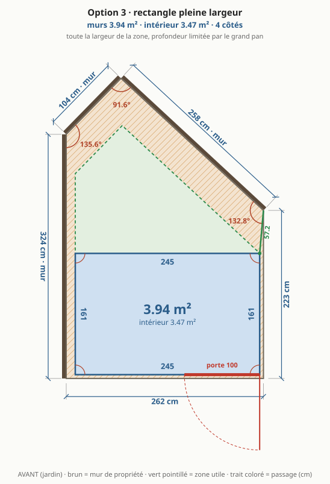

| | murs (extérieur) | intérieur |
|---|---|---|
| surface | 3,94 m² | **3,47 m²** |
| côté avant | 245 cm | 233 cm |
| côté droite | 161 cm | 149 cm |
| côté fond | 245 cm | 233 cm |
| côté gauche | 161 cm | 149 cm |
| angles | 90° · 90° · 90° · 90° | |
| passage arrière | grand pan 57,2 cm · petit pan 158,5 cm | |
| porte | 100 cm sur le côté avant, de 145 à 245 cm | |

- ✅ façade la plus large : porte et fenêtre côte à côte
- ✅ passage arrière confortable
- ⚠️ peu profond : le plus petit intérieur
- ⚠️ panneaux à recouper en largeur

## Option 4

**coin coupé, plafonné à 5 m²** · mur arrière reculé pour ne pas dépasser 5 m² de murs

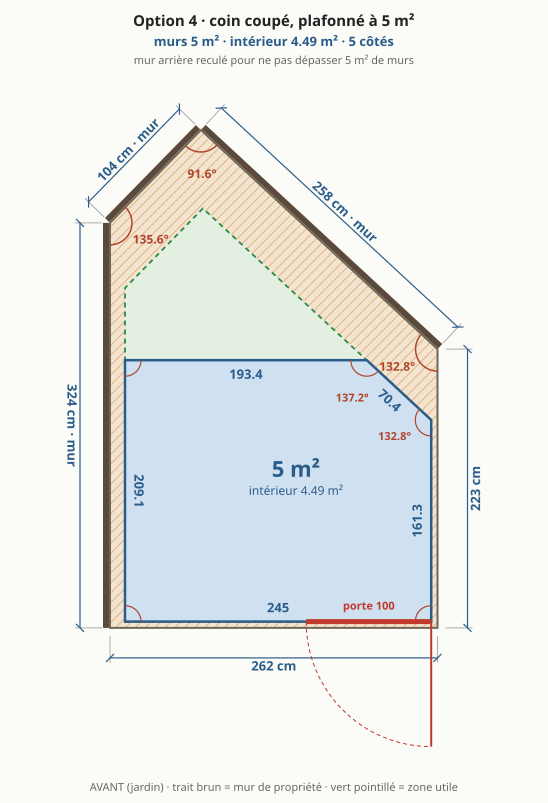

| | murs (extérieur) | intérieur |
|---|---|---|
| surface | 5 m² | **4,49 m²** |
| côté avant | 245 cm | 233 cm |
| côté droite | 161,3 cm | 152,7 cm |
| côté fond en biais | 70,4 cm | 65,4 cm |
| côté fond | 193,4 cm | 185 cm |
| côté gauche | 209,1 cm | 197,1 cm |
| angles | 90° · 90° · 132,8° · 137,2° · 90° | |
| passage arrière | grand pan 45 cm · petit pan 110,5 cm | |
| porte | 100 cm sur le côté avant, de 145 à 245 cm | |

- ✅ sous le seuil de surface
- ✅ pleine largeur et un seul pan coupé, court
- ⚠️ 5 murs et 2 angles obtus : profils d'angle sur mesure
- ⚠️ le pan coupé rogne un coin pour un petit gain

## Option 5

**coin coupé, pleine profondeur** · un pan coupé parallèle au mur du fond, le reste à angle droit

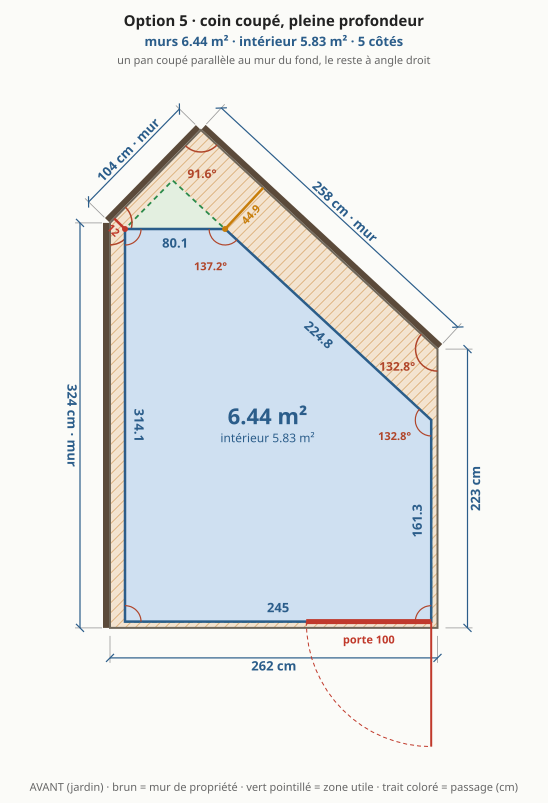

| | murs (extérieur) | intérieur |
|---|---|---|
| surface | 6,44 m² | **5,83 m²** |
| côté avant | 245 cm | 233 cm |
| côté droite | 161,3 cm | 152,7 cm |
| côté fond en biais | 224,8 cm | 219,8 cm |
| côté fond | 80,1 cm | 71,7 cm |
| côté gauche | 314,1 cm | 302,1 cm |
| angles | 90° · 90° · 132,8° · 137,2° · 90° | |
| passage arrière | grand pan 44,9 cm · petit pan 12 cm | |
| porte | 100 cm sur le côté avant, de 145 à 245 cm | |

- ✅ le plus grand intérieur sans angle aigu : que des angles obtus, faciles à meubler
- ✅ le pan coupé suit le mur du fond : passage régulier
- ⚠️ au-dessus du seuil : déclaration préalable probable
- ⚠️ 5 murs, 2 profils d'angle sur mesure, toit recoupé en biais, gouttière avec un angle

## Option 6

**toute la zone utile** · suit toute la zone : 3 angles non droits, pointe à l'arrière

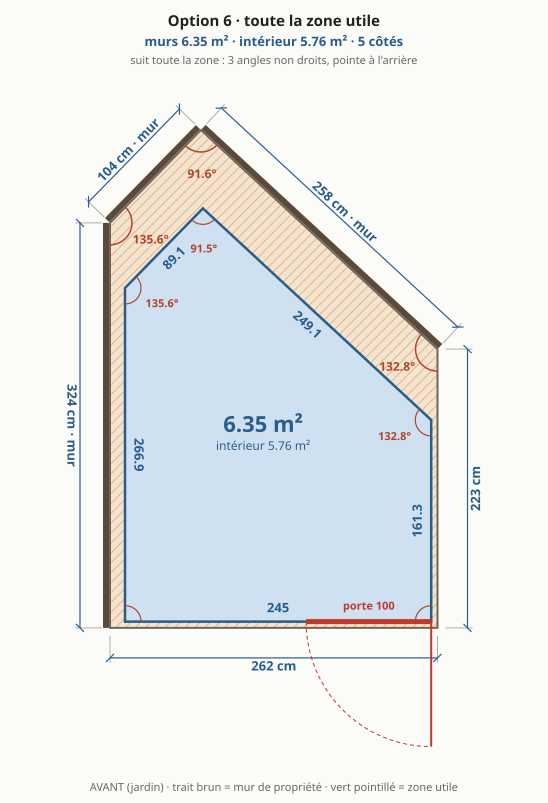

| | murs (extérieur) | intérieur |
|---|---|---|
| surface | 6,59 m² | **5,97 m²** |
| côté avant | 245 cm | 233 cm |
| côté droite | 161,3 cm | 152,7 cm |
| côté fond en biais | 282,1 cm | 273,6 cm |
| côté fond en biais | 54,5 cm | 46,2 cm |
| côté gauche | 314,1 cm | 305,7 cm |
| angles | 90° · 90° · 132,8° · 91,6° · 135,6° | |
| passage arrière | grand pan 44,9 cm · petit pan 12 cm | |
| porte | 100 cm sur le côté avant, de 145 à 245 cm | |

- ✅ la surface maximale de la zone
- ⚠️ la pointe du fond est un coin perdu
- ⚠️ 3 angles non droits, toit et gouttière les plus compliqués
- ⚠️ au-dessus du seuil

## Option 7

**plus grand rectangle, orientation libre** · 209.5 × 194.2 : aucune rotation ne fait mieux que le rectangle droit

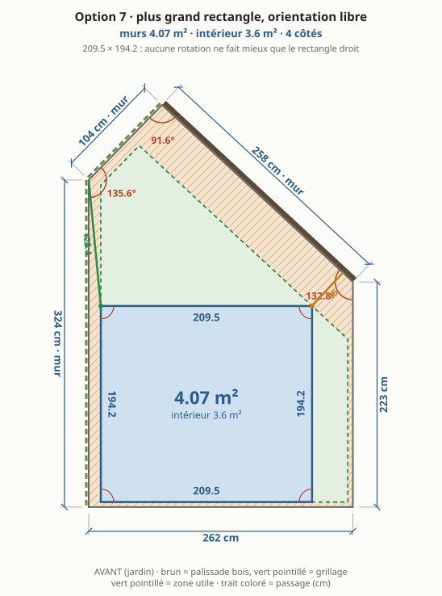

| | murs (extérieur) | intérieur |
|---|---|---|
| surface | 4,07 m² | **3,6 m²** |
| côté avant | 209,5 cm | 197,5 cm |
| côté droite | 194,2 cm | 182,1 cm |
| côté fond | 209,5 cm | 197,5 cm |
| côté gauche | 194,2 cm | 182,1 cm |
| angles | 90° · 90° · 90° · 90° | |
| passage arrière | grand pan 45 cm · petit pan 125,4 cm | |

- ✅ prouve qu'aucune rotation ne fait mieux qu'un rectangle droit
- ⚠️ identique à l'option 2 avec la zone actuelle

## Option 8

**plus grand quadrilatère** · 4 murs, le coin de 135.6° de la zone est sacrifié : l'aire maximale à 4 murs

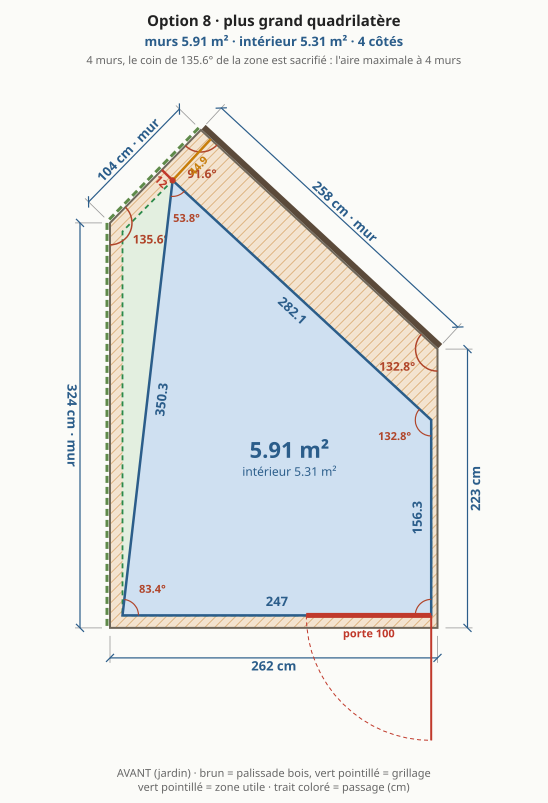

| | murs (extérieur) | intérieur |
|---|---|---|
| surface | 5,99 m² | **5,38 m²** |
| côté avant | 245 cm | 232,3 cm |
| côté droite | 161,3 cm | 152,7 cm |
| côté fond en biais | 282,1 cm | 267,5 cm |
| côté gauche en biais | 355,1 cm | 336,4 cm |
| angles | 83,8° · 90° · 132,8° · 53,3° | |
| passage arrière | grand pan 44,9 cm · petit pan 12 cm | |
| porte | 100 cm sur le côté avant, de 145 à 245 cm | |

- ✅ la plus grande surface possible avec 4 murs
- ⚠️ mur gauche en biais : un coin perdu en long contre le mur de propriété
- ⚠️ deux angles aigus, difficiles à meubler

## Option 9

**trapèze, mur arrière en biais** · côtés gauche et droit d'équerre sur l'avant, un seul mur en biais au fond

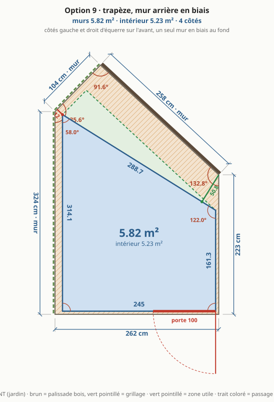

| | murs (extérieur) | intérieur |
|---|---|---|
| surface | 5,82 m² | **5,23 m²** |
| côté avant | 245 cm | 233 cm |
| côté droite | 161,3 cm | 152 cm |
| côté fond en biais | 288,7 cm | 274,6 cm |
| côté gauche | 314,1 cm | 297,3 cm |
| angles | 90° · 90° · 122° · 58° | |
| passage arrière | grand pan 50,8 cm · petit pan 12 cm | |
| porte | 100 cm sur le côté avant, de 145 à 245 cm | |

- ✅ 4 murs, un seul en biais, deux angles droits côté porte
- ✅ toit simple : un seul bord en biais
- ⚠️ au-dessus du seuil
- ⚠️ angle aigu au fond à gauche

## Option 10

**trapèze plafonné à 5 m²** · le trapèze 9, mur droit reculé à 198 de large : sous 5 m²

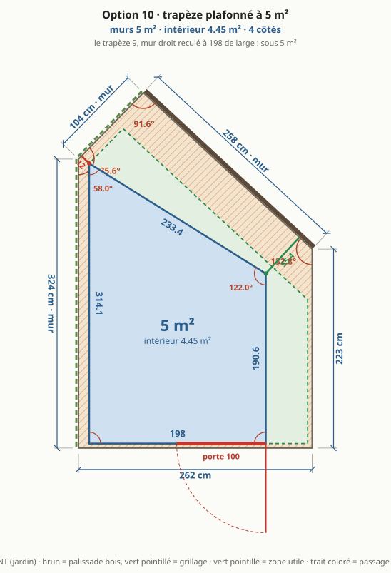

| | murs (extérieur) | intérieur |
|---|---|---|
| surface | 5 m² | **4,45 m²** |
| côté avant | 198 cm | 186 cm |
| côté droite | 190,6 cm | 181,3 cm |
| côté fond en biais | 233,4 cm | 219,2 cm |
| côté gauche | 314,1 cm | 297,3 cm |
| angles | 90° · 90° · 122° · 58° | |
| passage arrière | grand pan 55,4 cm · petit pan 12 cm | |
| porte | 100 cm sur le côté avant, de 98 à 198 cm | |

- ✅ sous le seuil, même forme que l'option 9
- ✅ passage arrière un peu élargi
- ⚠️ façade plus étroite

## Option 11

**trapèze pivoté, plafonné à 5 m²** · le trapèze 9, coin arrière droit abaissé à 94 : sous 5 m², passage arrière élargi

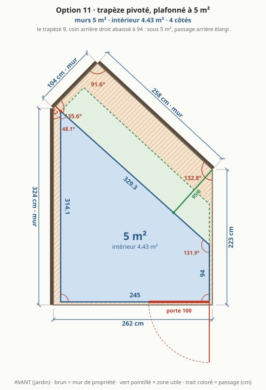

| | murs (extérieur) | intérieur |
|---|---|---|
| surface | 5 m² | **4,43 m²** |
| côté avant | 245 cm | 233 cm |
| côté droite | 94 cm | 85,3 cm |
| côté fond en biais | 329,3 cm | 313,2 cm |
| côté gauche | 314,1 cm | 294,6 cm |
| angles | 90° · 90° · 131,9° · 48,1° | |
| passage arrière | grand pan 95,6 cm · petit pan 12 cm | |
| porte | 100 cm sur le côté avant, de 145 à 245 cm | |

- ✅ sous le seuil sans perdre de largeur de façade
- ✅ le passage arrière le plus large des trapèzes
- ⚠️ mur droit court : peu de place pour une porte ou une fenêtre à droite
- ⚠️ angle aigu au fond à gauche, plus fermé que l'option 9

## Option 12

**coin coupé au module** · l'option 1 élargie à toute la façade : mur du fond 2 et mur gauche 2 modules de 100 sans recoupe, pan coupé parallèle au grand pan

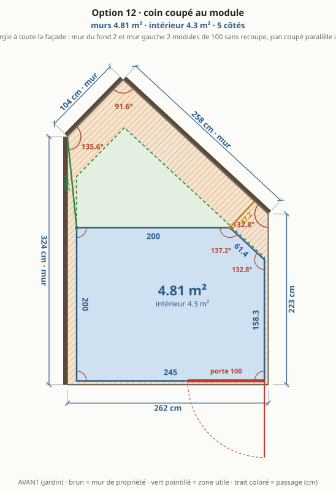

| | murs (extérieur) | intérieur |
|---|---|---|
| surface | 4,81 m² | **4,3 m²** |
| côté avant | 245 cm | 233 cm |
| côté droite | 158,3 cm | 149,7 cm |
| côté fond en biais | 61,3 cm | 56,4 cm |
| côté fond | 200 cm | 191,6 cm |
| côté gauche | 200 cm | 188 cm |
| angles | 90° · 90° · 132,8° · 137,2° · 90° | |
| passage arrière | grand pan 47,2 cm · petit pan 119,6 cm | |
| porte | 100 cm sur le côté avant, de 145 à 245 cm | |

- ✅ mur gauche et mur du fond en panneaux entiers : aucune recoupe sur les deux murs contre la propriété, inaccessibles après montage
- ✅ sous le seuil, même intérieur que le 200 × 240 d'origine
- ✅ façade pleine largeur : porte et fenêtre côté jardin
- ✅ que des angles droits ou obtus, pan coupé court
- ✅ le pan coupé tombe sous la bande de toit déjà recoupée : une seule coupe de toit en biais
- ⚠️ 5 murs et 2 angles obtus : profils d'angle pliés sur mesure
- ⚠️ 3 bandes de panneau à recouper (façade, mur droit, pan coupé), tirées de 2 panneaux
- ⚠️ gouttière arrière arrêtée avant le pan coupé

## Option 13

**trapèze, 50 cm derrière, ~4.8 m² intérieur** · mur arrière du haut du côté gauche, pivoté pour 50 cm de passage derrière, façade 218 pour ~4.8 m² intérieur

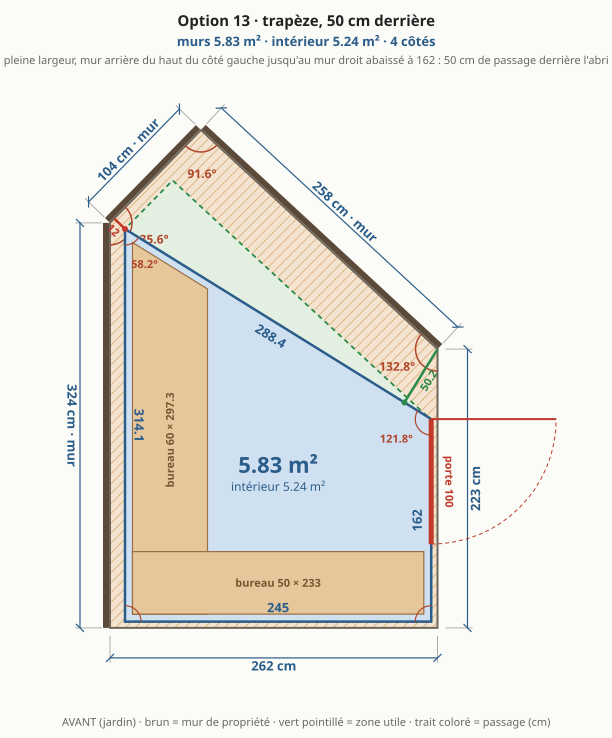

| | murs (extérieur) | intérieur |
|---|---|---|
| surface | 5,37 m² | **4,81 m²** |
| côté avant | 218 cm | 206 cm |
| côté droite | 178,8 cm | 169,4 cm |
| côté fond en biais | 256,6 cm | 242,5 cm |
| côté gauche | 314,1 cm | 297,3 cm |
| angles | 90° · 90° · 121,8° · 58,2° | |
| passage arrière | grand pan 50,6 cm · petit pan 12 cm | |
| porte | 65 cm sur le côté droite, de 113,8 à 178,8 cm | |
| fenêtre ouvrante | 80 × 110 cm sur le côté avant, de 10 à 90 cm, allège 95 cm | |
| fenêtre fixe | 80 × 110 cm sur le côté avant, de 110 à 190 cm, allège 95 cm | |
| bureau gauche | | 60 cm de profondeur sur 297,3 cm |
| bureau avant | | 50 cm de profondeur sur 206 cm |
| sol libre | | **2,41 m²** (bureaux 2,4 m²) |

- ✅ pleine largeur et la plus grande surface des trapèzes, avec le passage voulu derrière
- ✅ porte sur le côté droit : bureau en L sur tout le mur gauche et toute la façade
- ✅ façade libre pour des fenêtres, lumière sur le bureau
- ⚠️ au-dessus du seuil : déclaration préalable probable
- ⚠️ angle aigu au fond à gauche, occupé par le bout du bureau
- ⚠️ mur gauche très haut contre la propriété : panneau long, inaccessible après montage

